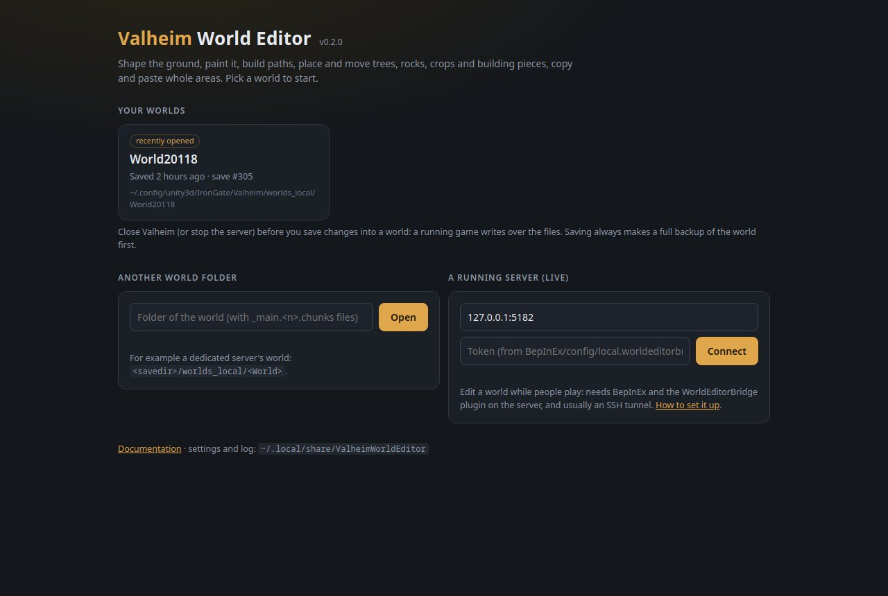

# Valheim World Editor


## What is this?

A world editor for Valheim, in the spirit of Minecraft's MCEdit, WorldEdit and WorldPainter. It
opens a Valheim world in its own window, drawn with the game's own terrain, textures and models. There you can:

- **Shape the ground**: raise, lower, flatten, smooth, naturalize or restore it, and paint dirt,
  cultivated soil or paved stone.
- **Build roads and ramps** along a line you draw.
- **Work on whole areas**: level, paint, clear or copy and paste a box or polygon, or have the game
  generate zones again from scratch.
- **Place anything the game has**: trees, rocks, bushes, crops, building pieces and so on, with
  brush, line, grid and zone patterns that respect the game's growing rules.
- **Select, move, turn, copy and delete objects**, including whole buildings.
- **Measure** distances and slopes, and see the ground coloured by steepness.
- **Undo anything**, with a history panel that can roll back to any point or remove one change.

It works in two ways:

| Mode | What it edits | When to use it |
|---|---|---|
| **Offline** | A world save on disk (single player world, or a server's world folder). | The game or server is stopped. Changes are written as a new save, with a full backup first. |
| **Online (live)** | The world of a running game or dedicated server, through the WorldEditorBridge plugin. | Players can stay connected; they see your changes as soon as you apply them. |

It is a single program for Windows and Linux: download, unpack, double-click. Everything runs on
your own computer; nothing is sent anywhere else.

## Installation

### What you need

- **Windows 10/11 or Linux**, 64-bit.
- **Valheim** installed through Steam on the same computer, for the game's look. The editor finds it
  by itself and copies the textures and models it needs from it, once. Without it the editor still
  works, with plain colours and no object models.
- A world in the current save format (a world folder with `_main.<n>.chunks` and `*.chunk` files).
  Worlds in the old single-file format are listed but greyed out: load them in Valheim once and
  they are converted.
- For **live mode** only: **BepInEx** on the server (or the game) that hosts the world, using
  [BepInExPack for Valheim](https://thunderstore.io/c/valheim/p/denikson/BepInExPack_Valheim/),
  plus the WorldEditorBridge plugin. Offline editing does not need BepInEx.

Nothing else: no Python, no .NET, no browser setup. Everything the editor needs comes in the
download. Its window uses the web engine of the system: Microsoft Edge WebView2 on Windows (part of
Windows 11 and of an up-to-date Windows 10) and WebKitGTK on Linux (installed with most desktops).
Without it, the editor opens in your web browser instead.

### Install and start

1. Download `ValheimWorldEditor-<version>-win-x64.zip` (Windows) or
   `ValheimWorldEditor-<version>-linux-x64.tar.gz` (Linux) from the
   [Releases](https://github.com/Shuiei/valheim-world-editor/releases) page.
2. Unpack it anywhere (Desktop, Documents…).
3. Double-click **ValheimWorldEditor** (`ValheimWorldEditor.exe` on Windows). It opens in its own
   window.



The first time, a bar at the top of the start page shows the editor copying the game's look from
your Valheim install (a few minutes, about 150 MB). You can already open a world meanwhile; the look
switches on when the copy is done. After a Valheim update it is copied again by itself. If Valheim is
not found, the bar asks for its folder (the one Steam installed it into, with `valheim_Data`).

### Edit a world saved on disk (offline)

1. **Close Valheim, or stop the server** that uses the world. A running game saves over the files
   the editor writes.
2. On the start page, click the world. Worlds in Valheim's usual folders are listed by themselves;
   for another one (a dedicated server's world, a copy), use **Another world folder** with
   **Browse…** or by typing the folder (`<savedir>/worlds_local/<World>` for a server).
3. The [world map](docs/map.md) opens: click a spot and choose **Edit in 3D**.
4. Edit, then press **Save to world**. The editor first copies the whole world folder to
   `<World>_backup_terraineditor-<date>`, then writes your changes as the next save number and reads
   them back to check them. Start the game or server again to see the result.

**Worlds** (on the map page) goes back to the start page to open another world.

### Edit a running server (live)

Players can stay connected while you edit; they see the changes as soon as you apply them, and the
game saves them as usual.

1. **Install BepInEx** on the server if it does not have it yet:
   [BepInExPack for Valheim](https://thunderstore.io/c/valheim/p/denikson/BepInExPack_Valheim/)
   (follow its instructions for dedicated servers, including how to start the server with
   BepInEx). Start the server once so BepInEx creates its `plugins` and `config` folders.
2. **Install the plugin.** Download `WorldEditorBridge.dll` from the
   [Releases](https://github.com/Shuiei/valheim-world-editor/releases) page, copy it into the
   server's `BepInEx/plugins/` folder and restart the server.
3. **Get the token.** On its first start the plugin writes
   `BepInEx/config/local.worldeditorbridge.cfg` with a random `Token`. Keep it secret: anyone with the
   token and access to the port can change the world.
4. **Open a tunnel** from your computer to the server. The plugin only listens on the server
   itself (`127.0.0.1`), so it is never exposed to the internet:

   ```sh
   ssh -N -L 5182:127.0.0.1:5182 user@your-server
   ```

   On Windows 10/11 the same command works in PowerShell or the Command Prompt (if `ssh` is not
   recognized, add "OpenSSH Client" in Settings → System → Optional features). With PuTTY: Connection →
   SSH → Tunnels, source port `5182`, destination `127.0.0.1:5182`. When the game runs on your own
   computer (single player, or host and play), skip this step.
5. On the start page, under **A running server (live)**, enter `127.0.0.1:5182` and the token, then
   **Connect**. If the server cannot be reached, the editor says why within 10 seconds.

A green **LIVE** badge shows in the top bar. Edit as usual, then press **Apply live** (or switch on
**Auto** to apply every change right away). More in [docs/live-mode.md](docs/live-mode.md).

### Where things are kept

Settings, the copied game files and a log are in `~/.local/share/ValheimWorldEditor` (Linux) or
`%LOCALAPPDATA%\ValheimWorldEditor` (Windows). The bottom of the start page shows the folder.

### Command line (optional)

The program also takes a world or a live server directly, which is handy for scripts:

```sh
ValheimWorldEditor "<world folder>"                                   # open that world
ValheimWorldEditor --live http://127.0.0.1:5182 --token <token>       # connect to a server
ValheimWorldEditor --browser                                          # use the web browser instead of a window
ValheimWorldEditor --port 5190                                        # a fixed port (default: the first free one from 5180)
```

### Building from source

```sh
dotnet publish TerrainEditor.csproj -c Release -r linux-x64 --self-contained -p:PublishSingleFile=true -o ../ValheimWorldEditor
```

Use `-r win-x64` for Windows. Publish outside the source folder: a folder inside it would be packed
into the next build. `tools/release.sh <version> <folder>` builds the complete release packages
(program, page, the exporter and its Python runtime). See [docs/development.md](docs/development.md).

## Documentation

| Page | Covers |
|---|---|
| [Getting around](docs/editor-basics.md) | Camera, top bar, saving, discarding, history, View panel, shortcuts |
| [World map](docs/map.md) | The overview map and opening an area in 3D |
| [Ground tools](docs/terrain.md) | Raise, Lower, Flatten, Smooth, Naturalize, Restore, ground paint |
| [Path](docs/path.md) | Roads, ramps and paint along a line |
| [Mask](docs/masks.md) | Limiting any tool by biome, height, slope or paint |
| [Area, copy and paste](docs/area.md) | Box and polygon selections, bulk actions, paste, zone reset |
| [Plant](docs/plant.md) | Brush, Line, Grid and Zone placement, any kind of object |
| [Select](docs/select.md) | Selecting, moving with arrows, turning, dropping, copying, deleting |
| [Measure and overlays](docs/measure.md) | Distances, slopes, slope colours, height lines |
| [Live mode](docs/live-mode.md) | Editing a running server |
| [Development](docs/development.md) | Project layout, extracting the game files, tests |

What changed and when: [CHANGELOG.md](CHANGELOG.md).

## Safety

- Offline saves always make a full backup of the world folder first, and the save is read back and
  checked before the editor reports success.
- The editor follows the game's own limits: ground moves at most 8 m from its original height, and
  the edge of the loaded area is locked so it joins its neighbours seamlessly.
- Nothing is written until you press **Save to world** or **Apply live**; **Discard** undoes
  everything that is not saved or applied yet.
- Keep your own copies of worlds you care about anyway.
