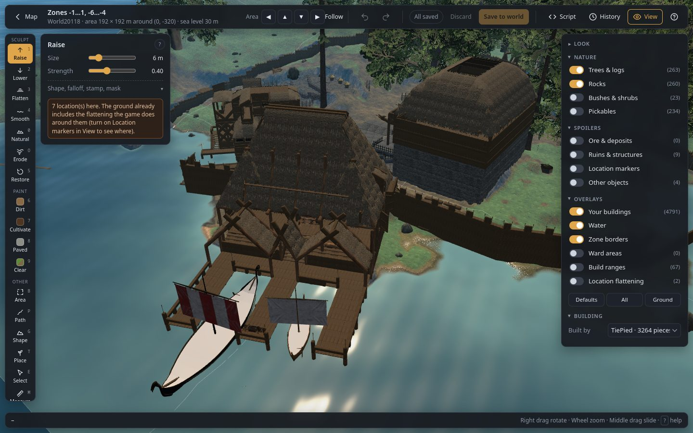
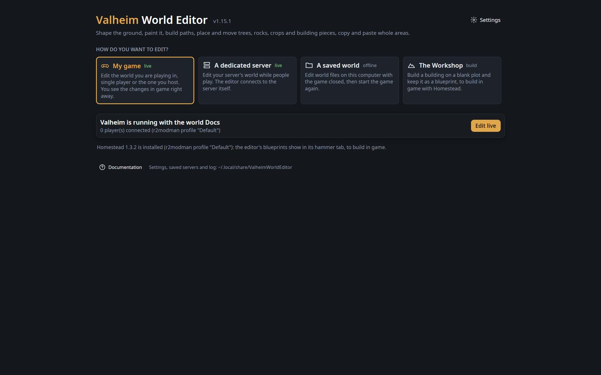
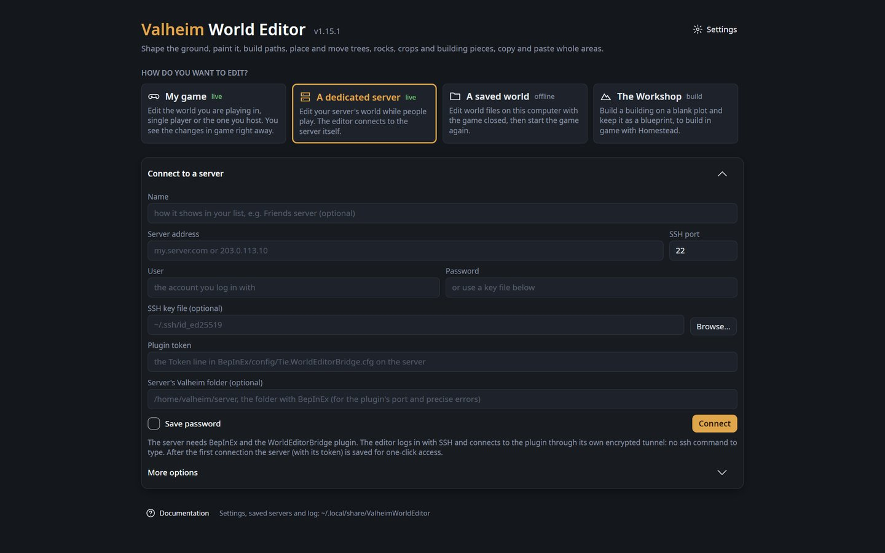
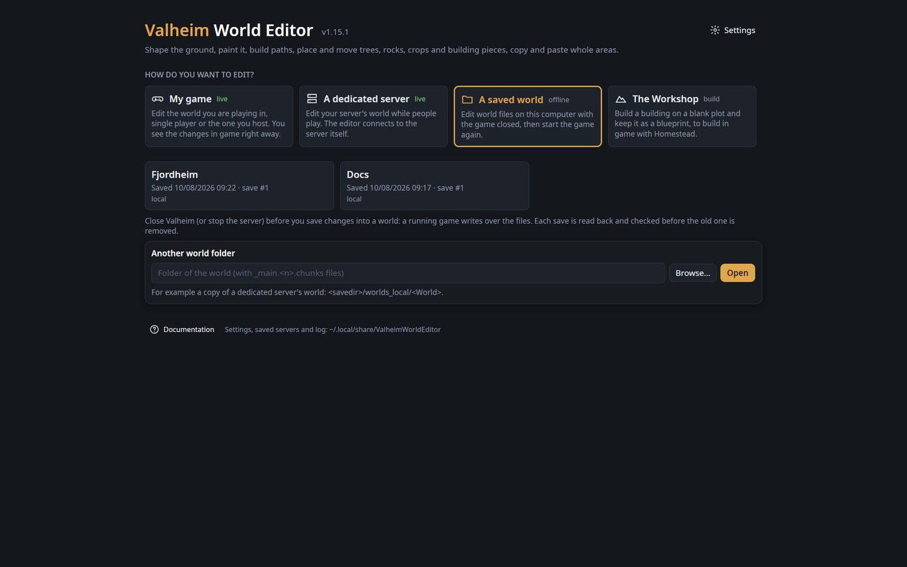
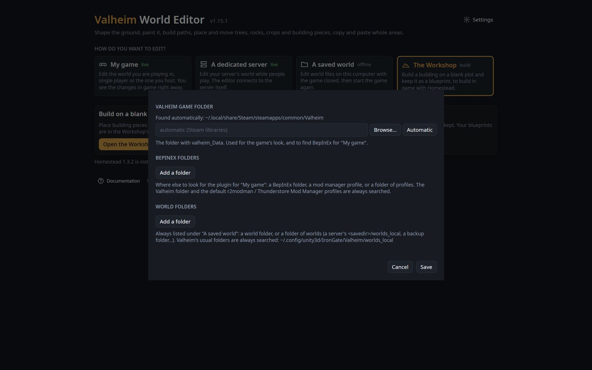

# Valheim World Editor

[](https://dl.circleci.com/status-badge/redirect/gh/Shuiei/valheim-world-editor/tree/main)
[](https://github.com/Shuiei/valheim-world-editor/releases/latest)

**A world editor for Valheim, in the spirit of Minecraft's MCEdit, WorldEdit and WorldPainter.**
Open a world, saved or running, in a 3D window that draws it with the game's own terrain, textures
and models. Shape the land, build, place and move anything, then save it back or watch it change in
game as you work.



**[Download the latest release](https://github.com/Shuiei/valheim-world-editor/releases/latest)**
for Windows or Linux. Unpack it and start it. You don't need to install anything else.

## What you can do

**Terrain**
- **Sculpt the ground** with brushes that raise, lower, flatten, smooth, erode, naturalize or restore
  it, and **paint** it with dirt, cultivated soil or paved stone.
- **Go past the game's ±8 m limit.** Raise mountains, ridges and volcanoes, or dig canyons, with a
  preview before you click. The editor stores that ground as invisible locations the game levels by
  itself. It works for every player, console players included, and nobody needs a mod.
- **Draw roads, ramps, rivers and caves** along a line. Caves are roofed with the game's own
  boulders.

**Building**
- **The Workshop** is a blank plot where you build with every piece the game has: hammer,
  cultivator and serving tray. Pieces snap exactly as they do with the in-game hammer. A **support
  check** tints each piece green to red, like the game's build mode. **Cut** shows the building only
  up to a height, so you can work inside it.
- **Blueprints** are saved in the format of [Homestead](https://thunderstore.io/c/valheim/p/sighsorry/Homestead/).
  A building you save in the editor shows up in Homestead's hammer tab, ready to build in game. One
  you save in game opens in the editor. The library shows each blueprint's 3D picture, cost,
  description and tags. You can drag a blueprint onto the plot or drop `.blueprint` (Homestead,
  PlanBuild) and `.vbuild` files on it.
- **Paste a blueprint into any world.** Before you click, it shows as see-through models. It clears
  its site: the ground in the way is dug out, and the trees and rocks there are removed.

**Objects**
- **Place anything the game has**: trees, rocks, bushes, crops and building pieces. Use a brush,
  lines, circles, grids or whole zones; the brush follows the game's growing rules.
- **Select, move, turn, copy and delete** objects, whole buildings included.
- **Look inside objects and change what they hold**: chest contents, sign texts, portal tags…
- **Search the whole world** for a kind of object, an item in any chest, or the text of a sign.

**Areas and worlds**
- **Work on an area**, a box or polygon: level, paint, clear, copy and paste it. You can also have the
  game generate its zones again from scratch.
- **Restore an area from a backup**, ground and objects, to undo griefing without rolling back the
  whole world.
- **Write C# scripts** that shape, paint and fill an area with terrain, trees, rocks and buildings.
- **Measure** distances and slopes, and colour the ground by steepness.
- **Undo anything.** The history panel goes back to any point, or takes out one change only.

## Three ways to edit

All three start from the editor's start page.

| | What it edits | What you need |
|---|---|---|
| **My game** (live) | The world you are playing: single player, or the one you host. Changes show in game right away. | BepInEx and the WorldEditorBridge plugin in your Valheim. |
| **A dedicated server** (live) | Your server's world, while people play. The editor logs in over SSH and opens its own encrypted tunnel. | BepInEx and the plugin on the server, and an SSH login to it. |
| **A saved world** (offline) | World files on this computer, with the game closed. | Nothing. |

**The Workshop**, the fourth card on the start page, needs no world at all.


One program runs on Windows and Linux, and everything happens on your computer. Nothing is sent
anywhere else.

## Quick start

1. Download `ValheimWorldEditor-<version>-win-x64.zip` (Windows) or `-linux-x64.tar.gz` (Linux) from
   the [releases page](https://github.com/Shuiei/valheim-world-editor/releases/latest).
2. Unpack it anywhere and double-click **ValheimWorldEditor**.
3. Pick a way to edit on the start page. To try it safely, open **A saved world** with the game
   closed, or **The Workshop**.

The sections below cover each step in more detail.

## Installation

### What you need

- **Windows 10/11 or Linux**, 64-bit.
- **Valheim** installed through Steam on the same computer, for the game's look. The editor finds it
  by itself and copies the textures and models it needs from it, once. Without it the editor still
  works, with plain colours and no object models.
- For the **live** ways: **BepInEx** in the game that hosts the world (your Valheim, or the
  server), using [BepInExPack for Valheim](https://thunderstore.io/c/valheim/p/denikson/BepInExPack_Valheim/),
  plus the WorldEditorBridge plugin (its own download, next to the editor's). Players who join need
  neither.

Nothing else: no Python, no .NET, no `ssh` command. Everything the editor needs comes in the
download: one program file, drawn with OpenGL (any graphics driver of the last ten years; on
Windows it falls back to Direct3D when the driver has no OpenGL).

### Install and start

1. Download `ValheimWorldEditor-<version>-win-x64.zip` (Windows) or
   `ValheimWorldEditor-<version>-linux-x64.tar.gz` (Linux) from the
   [Releases](https://github.com/Shuiei/valheim-world-editor/releases) page.
2. Unpack it anywhere (Desktop, Documents…). It holds the editor and its `README.txt`. For live
   editing, the WorldEditorBridge plugin is a separate download: `WorldEditorBridge-<version>.zip`
   on the same page, or from a mod manager (below).
3. Double-click **ValheimWorldEditor** (`ValheimWorldEditor.exe` on Windows). It opens in its own
   window, on the start page. (Windows may say "Windows protected your PC" the first time: the
   program is not signed. Click "More info", then "Run anyway".)



The first time, a card on the start page shows the editor copying the game's look from your Valheim
install (a few minutes, about 150 MB); you can already start editing meanwhile, and the areas you
open once it is done have the game's textures and models. After a Valheim update it is copied again
by itself. If Valheim is not found, the card asks for its folder (the one Steam installed it into,
with `valheim_Data`).

### My game (live)

1. **Install BepInEx** in your Valheim, once: [BepInExPack for Valheim](https://thunderstore.io/c/valheim/p/denikson/BepInExPack_Valheim/),
   either with a mod manager (r2modman, Thunderstore Mod Manager) or by hand into the Valheim folder,
   following its page.
2. **Add the plugin:** with a mod manager, install
   [WorldEditorBridge](https://thunderstore.io/c/valheim/p/Tie/WorldEditorBridge/) from
   Thunderstore or Hexium (BepInEx comes with it). By hand: copy `WorldEditorBridge.dll` from
   `WorldEditorBridge-<version>.zip` (on the releases page) into `BepInEx/plugins` of your Valheim.
   The editor itself is only on the
   [releases page](https://github.com/Shuiei/valheim-world-editor/releases): Thunderstore does not
   host programs.
3. **Start Valheim** with BepInEx and load your world (single player, or start a server from the
   game to host it). On this first start the plugin writes its settings,
   `BepInEx/config/Tie.WorldEditorBridge.cfg`, with a random token. The editor reads that file, so
   the game has to have started once with the plugin.
4. On the start page, **My game** shows "Valheim is running with the world …": click **Edit live**.
   On your own computer it finds the plugin and its token by itself, also in mod manager profiles.

Edit, then **Apply live** (or switch on **Auto** to apply every change right away): you see it in
game at once, and the game saves it as usual.

### A dedicated server (live)



1. **On the server, once:** install BepInEx (BepInExPack for Valheim, following its instructions
   for dedicated servers), copy `WorldEditorBridge.dll` (from `WorldEditorBridge-<version>.zip` on
   the releases page) into its `BepInEx/plugins` (or install
   [WorldEditorBridge](https://thunderstore.io/c/valheim/p/Tie/WorldEditorBridge/) in a mod
   manager's server profile).
2. **Start the server once with the plugin**, so it writes `BepInEx/config/Tie.WorldEditorBridge.cfg`.
   That file holds the plugin's **token**, a random secret made on that first start. Until the
   server has started once with the plugin, there is no token to enter. See the `README.txt` in the
   plugin's zip.
3. On the start page, **A dedicated server**: enter the server's address, the user you log in to it
   with (SSH), the password or an SSH key file, and the **plugin token**: the `Token` line of
   `BepInEx/config/Tie.WorldEditorBridge.cfg` on the server. Tick **Save password** to not type the
   password again.
4. **Connect.** The editor logs in, opens its own encrypted tunnel to the plugin and loads the
   world. The plugin only listens on the server itself, so it is never exposed to the internet.
5. The server is then **saved** in the list, with its token: next time it is one click.

If something is wrong, the editor says what: login refused, no answer, wrong token, plugin not
running on the server, or a server whose identity changed since last time (it refuses to connect
then). Already
have your own tunnel (`ssh -L`, PuTTY)? Use **More options → I made my own tunnel**. More in
[docs/live-mode.md](docs/live-mode.md).

### A saved world (offline)



1. **Close Valheim, or stop the server** that uses the world. A running game saves over the files
   the editor writes.
2. On the start page, **A saved world**: click the world. Worlds in Valheim's usual folders are listed
   by themselves; for another one (a copy of a server's world, for example) use **Another world
   folder** with **Browse…** or by typing it (`<savedir>/worlds_local/<World>` for a server).
3. Edit, then **Save to world**. The editor writes your changes as the next save and reads them back
   to check them (if they do not read back right, the new files are removed and nothing changed).
   As with Apply live, the world stays open with its history: undo a step and save again to take it
   back. The save the world was opened from is kept until you leave the world, then only the latest
   save stays. Start the game or server again to see the result.

In every way, the [world map](docs/map.md) opens first: click a spot and choose **Edit in 3D**.
**Worlds** (on the map page) goes back to the start page.

### Game, plugin and worlds not where they usually are



The editor looks in the usual places by itself: Valheim in every Steam library (also Flatpak Steam
and extra libraries), BepInEx in the Valheim folder and in the default r2modman / Thunderstore Mod
Manager profiles, and worlds in Valheim's own world folders (Proton's too). When yours are
elsewhere, set them in **Settings** on the start page:

- **Valheim game folder**: the folder with `valheim_Data` (a copy outside Steam, a second install…).
  **Automatic** goes back to searching the Steam libraries.
- **BepInEx folders**: a `BepInEx` folder, a mod manager profile, or a folder of profiles (a mod
  manager with its own data folder). Used to find the plugin for **My game**.
- **World folders**: a world, or a folder of worlds (a server's `<savedir>/worlds_local` copy, a
  backup folder…). Always listed under **A saved world**.

For a **dedicated server**, the server form has an optional **Server's Valheim folder** (the
folder with its `BepInEx`, for example `/home/valheim/server`). With it the editor reads the
plugin's port from the server and, when the plugin does not answer, says exactly why: no BepInEx
there, no plugin in `BepInEx/plugins`, or a server that is not running with BepInEx. It is saved
with the server; **edit** next to a saved server changes it. (The token is still always typed.)

### Where things are kept

Settings, saved servers (`servers.cfg`), what the editor remembers between runs, blueprints, the
copied game files and a log (`log.txt`, a new one each run) are in `~/.local/share/ValheimWorldEditor`
(Linux) or `%LOCALAPPDATA%\ValheimWorldEditor` (Windows). The bottom of the start page shows the
folder.

## Documentation

| Page | Covers |
|---|---|
| [Getting around](docs/editor-basics.md) | Camera, top bar, saving, discarding, history, View panel, shortcuts |
| [World map](docs/map.md) | The overview map and opening an area in 3D |
| [Ground tools](docs/terrain.md) | Raise, Lower, Flatten, Smooth, Naturalize, Restore, ground paint, No limit (past ±8 m), Mountain |
| [Path](docs/path.md) | Roads, ramps, rivers, caves and paint along a line |
| [Mask](docs/masks.md) | Limiting any tool by biome, height, slope or paint |
| [Area, copy and paste](docs/area.md) | Box and polygon selections, bulk actions, paste, zone reset |
| [The Workshop](docs/workshop.md) | Building on a blank plot, the support check, Homestead blueprints: library, cost, pictures, tags, sharing |
| [Place](docs/place.md) | Any kind of object: trees and rocks with a brush, walls and fences end to end along lines, circles and rectangles, grids and zones |
| [Select](docs/select.md) | Selecting, moving with arrows, turning, dropping, copying, deleting |
| [Measure and overlays](docs/measure.md) | Distances, slopes, slope colours, height lines |
| [Script](docs/scripting.md) | C# scripts that shape, paint and populate an area: how to write them, everything they can use, recipes |
| [Live mode](docs/live-mode.md) | Editing a running server |
| [Development](docs/development.md) | Project layout, extracting the game files, tests |

What changed and when: [CHANGELOG.md](CHANGELOG.md).

## Safety

- **Nothing is written until you choose to.** Edits stay in the editor until you press **Save to
  world** or **Apply live**. **Discard** drops everything that is not saved or applied yet.
- **Offline saves are checked.** The editor writes your changes as the world's next save and reads
  them back. If they don't read back right, the new files are removed and the world is as it was.
  The save you opened the world from is kept until you leave the world.
- **The editor follows the game's rules.** Ground moves at most 8 m from its original height, the
  way the game allows. Ground at that limit turns red (**View → Limit marks** hides it). The only
  way past the limit is **No limit** and **Mountain**, which use locations the game itself
  understands. The edge of the loaded area stays locked, so it joins its neighbours seamlessly.
- **The plugin is private.** WorldEditorBridge only listens on the computer it runs on, and it needs
  a secret token. A server is reached through the editor's own SSH tunnel and is never exposed to
  the internet.
- Keep your own copies of worlds you care about anyway.

## Questions

**Do the players on my server need anything?**
No. Only the game or server that hosts the world needs BepInEx and the plugin. Players who join,
console players included, need nothing. That also goes for mountains past ±8 m.

**Do I need Homestead?**
Only to build blueprints in game. The Workshop, the library and pasting blueprints into a world all
work without it. When Homestead is missing, the editor says so and links to it. Note that a server
running Homestead turns away players who don't have it, and console players can't install mods.

**The editor asks for a token. Where is it?**
In `BepInEx/config/Tie.WorldEditorBridge.cfg`, on the `Token` line. The plugin writes that file the
first time the game or server starts with it, so start it once after installing the plugin. For your
own game the editor reads the token by itself; for a dedicated server you copy it from the server.

**Can I edit while the game is running?**
Yes, in live mode with the plugin. For a saved world, close the game or stop the server first: a
running game saves over the files the editor writes.

**Is the editor on Thunderstore or Hexium?**
Only the plugin, [WorldEditorBridge](https://thunderstore.io/c/valheim/p/Tie/WorldEditorBridge/),
is there. The editor is a program, not a mod, so it is only on the
[releases page](https://github.com/Shuiei/valheim-world-editor/releases/latest). Use the same version
of both.

**Something is wrong or missing.**
[Open an issue](https://github.com/Shuiei/valheim-world-editor/issues). The editor's log
(`log.txt`, in the folder shown at the bottom of the start page) helps.

## For developers

### Command line

The program also takes a world or a live server directly, which is handy for scripts:

```sh
ValheimWorldEditor "<world folder>"                                   # open that world's map
ValheimWorldEditor --live http://127.0.0.1:5182 --token <token>       # connect to a game (or WORLD_BRIDGE_TOKEN)
ValheimWorldEditor --world "<world folder or name>" --zone 3,-2       # straight into the 3D editor there
```

### Building from source

```sh
dotnet publish Desktop/ValheimWorldEditor.Desktop.csproj -c Release -r linux-x64 --self-contained -p:PublishSingleFile=true -o ../ValheimWorldEditor
```

Use `-r win-x64` for Windows. `tools/release.sh <folder>` builds the complete release packages
(the program, the game-look exporter and its Python runtime); `tools/thunderstore.sh <folder>` the
plugin's (`WorldEditorBridge-<version>.zip`). The tests, as CircleCI runs
them on every push (the visual tests need a display and are left out):

```sh
dotnet test tests/Desktop.Tests/Desktop.Tests.csproj -c Release --filter "Category!=Visual"
```

See [docs/development.md](docs/development.md).
