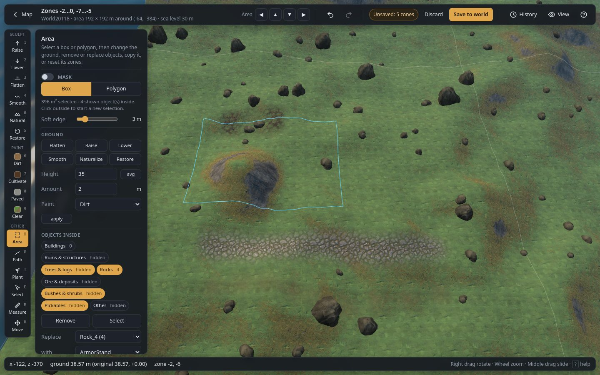
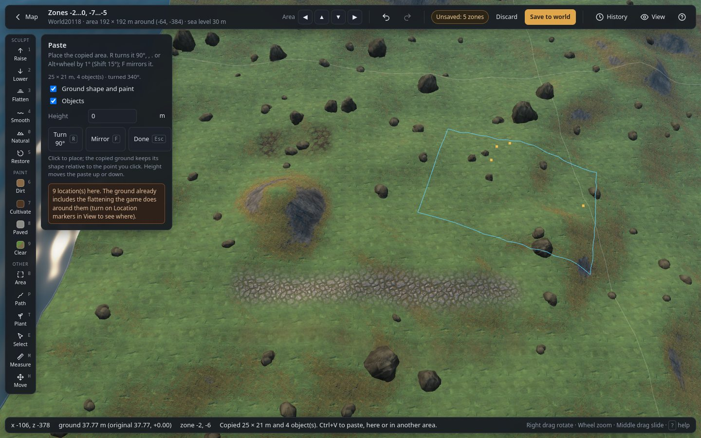

# Area, copy and paste (`B`)

The Area tool works on everything inside a box or polygon at once: the ground, the objects, or the
zones themselves. The [Mask](masks.md) applies to the ground actions.

## Selecting

| Control | What it does |
|---|---|
| **Box** | Drag a rectangle on the ground. |
| **Polygon** | Click corners; double-click or `Enter` closes the shape, `Backspace` removes the last corner. |
| `Esc` | Clears the selection. Clicking outside starts a new one. |

The panel shows the selected surface and how many shown objects are inside.

## Ground

| Control | What it does |
|---|---|
| **Soft edge** | Ground actions fade out over this many metres inside the edge of the selection, so the result blends in. |
| **Flatten** | Levels the ground inside to **Height**. |
| **Raise** / **Lower** | Lifts / digs the ground inside by **Amount**. |
| **Smooth** | Evens out bumps inside. |
| **Naturalize** | Natural-looking bumps inside (Bumps and Size of the Naturalize tool). |
| **Restore** | Puts the ground inside back to how the world generated it, and removes paint. |
| **Height** | Height (m) used by Flatten. **avg** sets it to the average ground height inside. |
| **Amount** | Metres used by Raise and Lower. |
| **Paint** + **apply** | Paints the ground inside with dirt, cultivated, paved, or clears the paint. |

Each button is one undo step.

## Objects inside

| Control | What it does |
|---|---|
| **Kind chips** | Which kinds the buttons act on, with how many are inside. "hidden" means the kind is switched off in View. |
| **Remove** | Removes the objects of the ticked kinds inside the selection. |
| **Select** | Selects them, to move, turn or copy them with the [Select tool](select.md). |
| **Replace** … **with** … | Replaces every object of the first kind inside by the second kind, at the same place and facing. The first list only offers kinds that are inside; the second offers every kind the game has. |

## Copy and paste

| Control | What it does |
|---|---|
| **Copy** (`Ctrl+C`) | Copies the ground shape, the paint and the shown objects inside the selection. The copy is kept in the browser, so you can paste it in another area or after a reload. |
| **Paste** (`Ctrl+V`) | Switches to pasting: the outline and the objects (orange dots) follow the cursor; click to place. You can paste several copies; `Esc` stops. |

While pasting:

| Control | What it does |
|---|---|
| **Ground shape and paint** | Paste the copied ground. The shape is kept relative to the point you click. |
| **Objects** | Paste the copied objects. They are new, independent objects: a pasted chest is an empty chest. |
| **Height** | Moves the pasted ground and objects up or down (m). |
| **Turn 90°** (`R`) | A quarter turn. `,` and `.` or Alt + wheel turn by 1° (Shift: 15°), to any angle. |
| **Mirror** (`F`) | Mirrors the paste. |
| **Done** (`Esc`) | Stops pasting. |

## Reset zones

| Control | What it does |
|---|---|
| **Keep my buildings** | Player-built pieces in the zones are kept. |
| **Reset ground edits too** | Also undoes the ground edits in the zones (height and paint). |
| **Reset zones…** | Marks every zone under the selection (red outline). On save, those zones lose their trees, rocks, ruins and dungeon entrances, and the game generates them again the next time a player goes there: new trees, new ore, new dungeons. You are asked to confirm first. |
| **Cancel reset** | Cancels the reset of the zones under the selection. |

Resetting is applied when you save (offline). It is not available in live mode yet.
