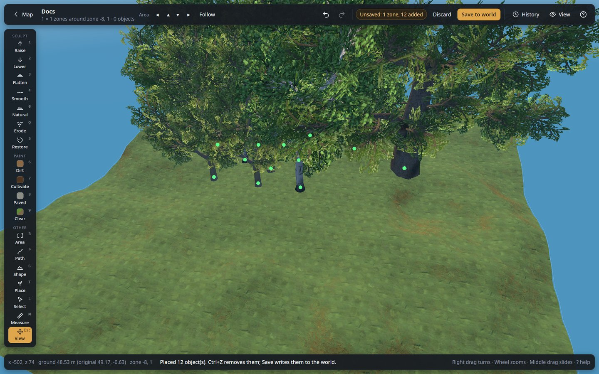

# Getting around the 3D editor

The editor shows an area of 3 × 3, 5 × 5 or 7 × 7 zones (a zone is 64 × 64 m) around the spot you
opened from the [world map](map.md). The window has five parts:

- **Top bar**: **Map**, the world's name and the area, the area arrows and **Follow**, undo and
  redo, what is pending, **Discard** and **Save to world** (or **Apply live**), and the
  **History**, **View** and **?** buttons.
- **Tool rail** (left): every tool, with its shortcut key in the corner.
- **Tool panel** (next to the rail): the current tool's name, a line saying what it does and how,
  and its settings. The [Mask](masks.md) has its own card next to it.
- **Right-hand panel**: **View** (`V`), **History** (`L`) or the help (`?`), one at a time.
- **Status bar** (bottom): where the mouse is (x and z in metres, the ground's height against the
  original, the zone), the last message, the selection, Walk or Fly, and a reminder of the mouse.

Every slider, switch and button explains itself when you hover it. The editor remembers your
choices between runs: what View shows, the brush's shape and falloff, the Area action, the Shape
preset (and your own formula), Select's options, the right-hand panel you left open, the map's
place and the clipboard.

## Camera

| Action | How |
|---|---|
| Turn the view | Right mouse drag |
| Zoom | Mouse wheel |
| Slide the view | Middle mouse drag, Space + left drag, Shift + right drag (in any tool), or the **View** tool (`H` or `Esc`) |
| Move around | `W` `A` `S` `D` or the arrow keys |
| See it as a player | `F`: **Walk** with your eyes 1.8 m above the ground (or the water), like a player; `F` again: **Fly** (Space up, C down); `F` again: back to the usual view. WASD move where you look, Shift runs, right drag looks around. The status bar says which. |
| Go to the next area | The **◀ ▲ ▼ ▶** arrows next to "Area" move it one zone (64 m). The camera stays where it is in the world, and your unsaved changes stay pending. History steps that fit the new area come along; the others are left out (the changes themselves stay). |
| Let the area follow you | **Follow** (next to the arrows): when the point you look at comes within 12 m of the area's edge, the area moves there by itself. It waits, and says why, while something would be lost: a stroke, a path being drawn, selected objects, changes being sent to the game. Remembered. |
| Back to the map | **Map** at the top left. What is not saved stays pending. |

## Top bar

| Control | What it does |
|---|---|
| **Undo** / **Redo** | Undo the last change (`Ctrl+Z`), redo it (`Ctrl+Y` or `Ctrl+Shift+Z`). Works for every tool. |
| **Pending** | "Unsaved: …" (offline) or "Not applied: …" (live): what is not written yet; "All saved" or "All applied" when nothing is. It counts zones whose ground really differs from the saved state, plus deleted and added objects, and zones marked for reset. In the view, every new object not saved (or applied) yet carries a green dot (**View → Unsaved marks** hides them). |
| **Discard** | Throws away what is not saved (or applied) yet, after asking: the last steps in History are undone, and the rest of the history stays. The camera and the tool stay as they are. When changes are pending that no step here can undo (made in another area), it offers to read the world again instead. |
| **Save to world** (offline, `Ctrl+S`) | Writes the changes into the world files: they go into the next save, and the result is read back and checked (if it does not read back right, the new files are removed and nothing changed). Like **Apply live**, the area and its history stay: undo a step and save again to take it back. The save the world was opened from is kept until you leave the world. No backup folder is made. Close the game or server first. |
| **Apply live** (live) | Sends the changes to the running game. See [live mode](live-mode.md). |
| **LIVE** (live) | Connected to the running game. |
| **Reload** (live) | Loads the world again from the game, after asking when changes are not applied yet. You stay where you are. |
| **Auto** (live) | Applies every change to the game as soon as it is done: each stroke when you let go, each tool, undo and redo. Remembered. |
| **History** (`L`) | Opens the history panel, below. |
| **View** (`V`) | Opens the View panel, below. |
| **?** | Mouse controls and keyboard shortcuts. |

## History

Every change of the session is listed, newest first, with how many zones or objects it touched.
Changes already applied to the game are tagged.

| Control | What it does |
|---|---|
| **Back to here** | Undoes every change made after this one. The later changes stay in the list, greyed out; **Redo to here** on a greyed one redoes up to it. |
| **Remove** | Takes out only this change and keeps everything done after it (for example, remove a tree line you planted an hour ago without losing the ground work you did since). |

Applied changes (live) can still be undone; the next apply then sends the undo.

The history follows you from area to area (the arrows, Follow, the map): it stays with the pending
changes. A change that touched ground outside the new area is left out, with every change before
it, since it could not be undone from there. Saving, Discard and reloading from the game start a
new history (what it described is written or gone).

## View panel

| Section | Control | What it does |
|---|---|---|
| Look | **Game look** | Draws the world with the game's own textures, models, water and sky. Off: plain colours and boxes. Remembered. |
| | **See-through buildings** | Draws players' buildings faint, to see the ground and objects inside or behind them. Trees and rocks stay solid. Remembered. |
| | **3D resolution** | How many pixels the 3D view draws: **Sharp (the screen's)**, **Balanced** or **Fast**. Fewer pixels give more frames per second on slow computers; the status bar says the size. Remembered. |
| Objects | **Your buildings**, **Ruins & structures**, **Trees & logs**, **Rocks**, **Ore & deposits**, **Bushes & shrubs**, **Pickables**, **Tamed animals**, **Runestones**, **Other objects** | Show or hide each kind. **Tamed animals** are the creatures players tamed (wild ones are under Other objects). The number is how many there are in the area. Ruins, ore, bushes, pickables and other objects are off at first, so the editor does not spoil what is still to be found. Placing or pasting a kind that is off switches it on, so what you placed stays visible (the message says so). |
| | **Water** | The sea and lake surface. |
| Overlays | **Zone borders** | The 64 m zone lines. |
| | **Location markers** | A post on every location (villages, the trader, dungeon entrances…). |
| | **Ward areas**, **Build ranges** | Rings on the ground: where each ward protects (32 m) and where each workbench, forge and other crafting station lets you build (10–40 m, by kind). |
| | **Location flattening** | Where locations flatten the ground: a ring for the flat part, a fainter one where it blends into the land. |
| | **Unsaved marks** | The green dot over each new object not saved (or applied) yet. |
| | **Limit marks** | The red on ground that reached the game's limit (8 m from its original height). |
| | **Defaults** / **All** / **Ground** | The usual switches / show everything / only the ground. They set the objects, the water and the overlays, not the look. |
| Building | **Built by** | The player written as the builder of every piece you place: see below. |
| Ground (game look) | **Slope colours**, **Height lines every … m** | Ground overlays, see [Measure](measure.md). |
| Players (live) | **Go to** | Turns the camera to a player when they are in the area; otherwise the area moves to them. Players are drawn in the 3D view as blue posts with their names. |

Only what is shown can be picked or selected. When an area holds locations (or has some within
40 m), a note at the bottom left says how many; the ground already includes the flattening the
game does around them.

## Player-built pieces

Everything a player can place with the hammer, the hoe, the cultivator or the serving tray is
**player built** in the game: it stores who built it. The editor writes the player chosen in
**View → Building → Built by** on every such piece it places, pastes or builds, as the game would.
Without a builder the game takes a piece for part of a ruin: taking it down gives only a third of
its materials back, a fire next to it is no base (monsters still spawn), raids ignore it, and a ward
or private chest answers to nobody.

**Built by** lists the players who built in this world (the one with the most pieces comes first and
is chosen at the start), the players named on beds, wards and tombstones, and the characters on this
computer (your own player id, even in a world where you built nothing yet). **Other player id…**
takes any id. **Nobody (not player built)** places pieces without a builder, as parts of a ruin. The
choice is remembered per world. With no player known at all, pieces get **Unknown player** (id 1):
they are player built, but wards and private chests answer to nobody, so choose your own id when
you can.

Pieces placed by older versions of the editor may have no builder: select them and press **Make
player built** (Select tool). Moving or editing an object keeps the builder it has.

## Shortcuts

The bottom of the help panel (**This computer**) says what draws the 3D view (the graphics card's
name and its OpenGL version), how the area loaded, and the frame rate while the view moves, with
the editor's own work per frame and how many objects and draws there are.

With **Record frame rates** (off each time the editor opens) the editor writes its frame rate to
`perf-native.log` in its data folder, a line every 0.2 s while the view is used. A header line
(`#`) gives the date, the version, the size of the 3D view, the graphics card and what is loaded
(written again when one changes); then each line says whether the camera was **moving**, or stood
**still** while something else happened (a stroke, the mouse), with the frames per second, the
editor's work per frame and the longest gap between two frames. Idle moments are not written. The
view is only drawn at full speed while something happens; otherwise a few times a second.

Everything the editor says also goes to `log.txt` in the same folder, a new one each run: send it
along when you report a problem.

| Key | Action |
|---|---|
| `1`–`9`, `0`, `O` | Raise, Lower, Flatten, Smooth, Restore, Dirt, Cultivate, Paved, Clear paint; Naturalize; Erode |
| `B` `P` `T` `G` | Area, Path, Place, Shape |
| `E` `M` `H` (or `Esc`) | Select, Measure, View |
| `F` | Walk at eye height, Fly, back to the usual view |
| `[` `]` | Brush size, 1 m at a time |
| `,` `.` / Alt + wheel | Turn (1°, Shift: 15°) in Select, Place and Paste |
| `R` | Paste: turn 90°. Place: a new random layout |
| `Alt` + click | Pick the ground height (Flatten, Path) |
| `Alt` + `Shift` + click | Set the mask's height range around a spot |
| `Ctrl+C` / `Ctrl+V` | Copy (Area, Select) / paste |
| `Del` | Delete the selected objects |
| `I` | Inspect the selected object |
| `PgUp` / `PgDn` / `End` | Lift, lower or drop the selection |
| `Ctrl+Z` / `Ctrl+Y` | Undo / redo |
| `Ctrl+S` | Save to world |
| `V` / `L` / `?` | View panel / History / Help |

## Limits

- Ground can move at most **8 m** from its original height (the game's own limit). Points at the
  limit turn **red** (game look), and the status bar says so under the mouse.
- The outer line of points of the area is **locked**, so the area always joins its neighbours
  without a step. To edit there, move the area with the arrows.
- Villages, the trader and similar locations flatten the ground around them while the game runs;
  the editor's ground already includes it.
