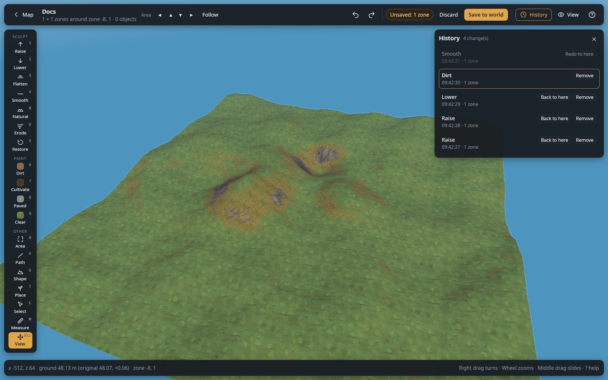
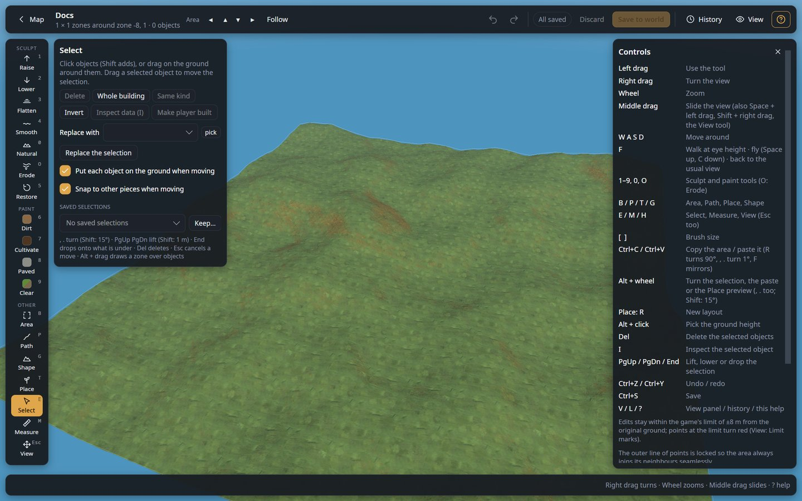

# Getting around the 3D editor

The editor shows an area of 3 × 3, 5 × 5 or 7 × 7 zones (a zone is 64 × 64 m) around the spot you
opened from the [world map](map.md). The screen has five parts:

- **Top bar**: map link, area arrows, undo and redo, the pending counter, Save / Discard, and the
  History, View and Help buttons.
- **Tool rail** (left): every tool, with its shortcut key in the corner.
- **Tool panel** (next to the rail): the settings of the current tool. Its title and first line
  say what the tool does.
- **View panel** (right, `V`): what is drawn.
- **Status bar** (bottom): the position, ground height and zone under the cursor, and messages.

Every slider, switch and button explains itself when you hover it.

## Camera

| Action | How |
|---|---|
| Rotate the view | Right mouse drag |
| Zoom | Mouse wheel |
| Slide the view | Middle mouse drag, Space + left drag, Shift + right drag, or the **Move** tool (`H`) |
| Move around | `W` `A` `S` `D` or the arrow keys |
| Go to the next area | The **◀ ▲ ▼ ▶** arrows next to "Area" (moves one zone, 64 m) |
| Back to the map | **Map** at the top left |

## Top bar

| Control | What it does |
|---|---|
| **Undo** / **Redo** | Undo the last change (`Ctrl+Z`), redo it (`Ctrl+Y` or `Ctrl+Shift+Z`). Works for every tool. |
| **Pending counter** | "Unsaved: …" (offline) or "Not applied: …" (live): what is not written yet. "All saved" / "All applied" when nothing is pending. It counts zones whose ground really differs from the saved state, plus deleted and added objects. |
| **Discard** | Undoes every change that is not saved or applied yet. Saved and applied changes stay, and the page is not reloaded (your tool and camera stay as they are). |
| **Save to world** (offline) | Writes the changes into the world files. A copy of the whole world folder is made first (`<World>_backup_terraineditor-<date>`), the changes go into the next save number, and the result is read back and checked. Close the game or server first. |
| **Apply live** (live) | Sends the changes to the running game. See [live mode](live-mode.md). |
| **LIVE**, **Reload**, **Auto** (live) | Shown only in live mode: connected badge, load the world again from the game, apply every change right away. |
| **History** (`L`) | Opens the history panel, below. |
| **View** (`V`) | Opens the View panel, below. |
| **?** | Mouse controls and keyboard shortcuts. |

## History

Every change of the session is listed, newest first, with its time and how many zones or objects it
touched.

| Control | What it does |
|---|---|
| **Back to here** | Undoes every change made after this one. The later changes stay in the list, greyed out; click a greyed one to redo up to it. |
| **Remove** | Takes out only this change and keeps everything done after it (for example, remove a tree line you planted an hour ago without losing the ground work you did since). |

Applied changes (live) and saved changes can still be undone; the next save or apply then writes
the undo.

## View panel

Click a section title to fold or unfold it; folded sections are remembered. **Look** starts
folded.

| Section | Control | What it does |
|---|---|---|
| Look | **Game look** | Draws the world with the game's own textures, models, water and sky. Off: flat colours, faster on slow computers. |
| | **See-through buildings** | Makes buildings half see-through, to see the ground and objects inside them. |
| | **Slope colours**, **Height lines** | Ground overlays, see [Measure](measure.md). |
| Nature | **Trees & logs**, **Rocks**, **Bushes & shrubs**, **Pickables** | Show or hide each kind. The number is how many there are in the area. |
| Spoilers | **Ore & deposits**, **Ruins & structures**, **Location markers**, **Other objects** | Off by default, so the editor does not spoil what is still to be found. |
| Overlays | **Your buildings**, **Water**, **Zone borders** | Player-built pieces, the sea surface, the 64 m zone lines. |
| | **Defaults** / **All** / **Ground** | Default switches / show everything / show only the ground. |
| Building | **Built by** | The player written as the builder of every piece you place: see below. |

Only what is shown can be picked or selected. Objects you placed but did not save yet are always
drawn (with a green dot), and placing a kind that is switched off switches it on, so you never
lose sight of what you placed.

## Player-built pieces

Everything a player can place with the hammer, the hoe, the cultivator or the serving tray is
**player built** in the game: it stores who built it. The editor writes the player chosen in
**View → Building → Built by** on every such piece it places, pastes or builds, as the game would.
Without a builder the game takes a piece for part of a ruin: taking it down gives only a third of
its materials back, a fire next to it is no base (monsters still spawn), raids ignore it, and a ward
or private chest answers to nobody.

**Built by** lists the players who built in this world (the one with the most pieces comes first and
is chosen at the start), the players named on beds, wards and tombstones, and the characters on this
computer (your own player id, even in a world where you built nothing yet). **Other player id…**
takes any id. The choice is remembered per world. With no player known at all, pieces get
**Unknown player** (id 1): they are player built, but wards and private chests answer to nobody, so
choose your own id when you can.

Pieces placed by older versions of the editor may have no builder: select them and press **Make
player built** (Select tool). Moving or editing an object keeps the builder it has.

## Shortcuts

| Key | Action |
|---|---|
| `1`–`9`, `0`, `O` | Raise, Lower, Flatten, Smooth, Restore, Dirt, Cultivate, Paved, Clear paint; Naturalize; Erode |
| `B` `P` `T` `G` | Area, Path, Place, Shape |
| `E` `M` `H` | Select, Measure, Move view |
| `[` `]` | Brush size |
| `,` `.` / Alt + wheel | Turn (1°, Shift: 15°) in Select, Place and Paste |
| `Alt` + click | Pick the ground height (Flatten, Path) |
| `Alt` + `Shift` + click | Fill the mask's height range around a spot |
| `Ctrl+C` / `Ctrl+V` | Copy (Area, Select) / paste |
| `Del` | Delete the selected objects |
| `Ctrl+Z` / `Ctrl+Y` | Undo / redo |
| `V` / `L` / `?` | View panel / History / Help |

## Limits

- Ground can move at most **8 m** from its original height (the game's own limit). Points at the
  limit turn **red**, and the status bar says so.
- The outer line of points of the area is **locked**, so the area always joins its neighbours
  without a step. To edit there, move the area with the arrows.
- Villages, the trader and similar locations flatten the ground around them while the game runs;
  the warning box in the tool panel says how many are in the area.
