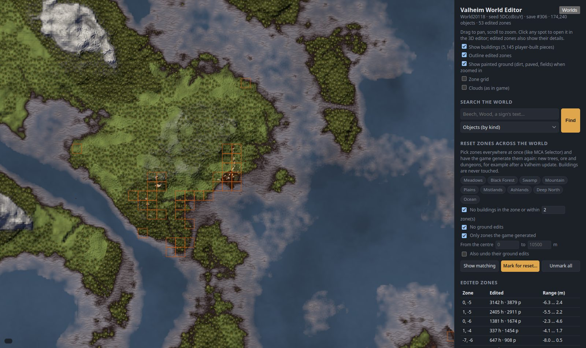

# World map

Opening a world shows a map of the whole world, drawn like the game's own map, so it looks like
the in-game map with everything revealed. **Worlds** at the top of its panel goes back to the start
page; the panel also says the world's name, seed, save number and how many objects it holds.

## Using it

- **Drag** to pan, **scroll** to zoom. The map remembers where it was.
- **Click** any spot: the panel shows the zone and its biome, with **Edit in 3D** and a size choice.
- The coordinates and zone under the cursor are shown at the bottom.
- In live mode, the players online are drawn with their names, and the panel says how many there
  are.

## Controls

| Control | What it does |
|---|---|
| **Show buildings** | Draws the footprint of every player-built piece. The number is how many pieces the world has. |
| **Outline edited zones** | Outlines the zones whose ground was edited, in game or in the editor. |
| **Show painted ground** | When zoomed in, draws dirt, paved and cultivated ground (fields). |
| **Zone grid** | Draws the 64 m zone grid. |
| **Clouds (as in game)** | Draws the drifting cloud shadows of the in-game map. |
| **Edit in 3D** | Opens the 3D editor around the clicked spot. |
| **Size** (next to Edit in 3D) | How much ground the editor loads: 3 × 3 zones (192 m), 5 × 5 (320 m) or 7 × 7 (448 m). Bigger areas are slower to load and draw. |
| **Save to world…** / **Apply live** / **Discard** | Same as in the editor: write or throw away the pending changes. The line above them says what is pending. |
| **Reload from the game** | Live mode only: load the world again from the running game. |

## Search the world

Find things anywhere in the world, like Amulet's find or WorldEdit's `//count`. Type part of a name or
text (not case sensitive), choose what to look for, and press **Find** (or `Enter`). The
section folds with its title, like the two below:

| Look for | Finds |
|---|---|
| **Objects (by kind)** | Every object whose kind contains the text: `portal`, `beech`, `chest`, `guard_stone`... The game's own bookkeeping objects (names starting with `_`) only when the text starts with `_`. |
| **Items in containers** | Every chest, cart or ship holding an item whose name contains the text: `Wood`, `Draugr`, `Silver`... with how many it holds. |
| **Texts (signs, portals, wards…)** | Every object with a text that contains it: sign texts, portal tags, ward and tombstone names. |

The results show how many there are of each kind (for items, how many in all), and every one is
pinned on the map in orange. Click one in the list to go there: the map centres on it and **Edit in
3D** opens the editor with that object selected (and, for items and texts, its
[data](select.md#inspecting-and-changing-an-objects-data) open). Objects deleted but not saved yet are
not found; objects placed but not saved yet are.

## Reset zones across the world

Like Minecraft's MCA Selector: pick zones anywhere in the world by what they are, and have the game
generate them again (new trees, ore, dungeons...), for example to get the new content of a Valheim
update in places nobody has built.

| Control | What it does |
|---|---|
| **Biome chips** | Only zones whose middle is in these biomes. None picked = every biome. |
| **No buildings in the zone or within N zones** | Leaves out zones near player-built pieces. Zones that hold pieces are always left out: the map never resets buildings. |
| **No ground edits** | Leaves out zones whose ground was edited (in game or in the editor). |
| **Only zones the game generated** | Only zones a player has already visited (the game generated them). Off: also zones that only hold objects placed by the editor. |
| **From the centre … to … m** | Only zones at this distance from the middle of the world. Empty = no limit. |
| **Also undo their ground edits** | Resets the ground of the zones too (when No ground edits is off). |
| **Show matching** | Colours the matching zones blue on the map and counts them and their objects. The filters update it as you change them. |
| **Mark for reset…** | Marks every matching zone for reset (red), after asking. **Save to world** (or **Apply live**) does it, with a backup first offline. |
| **Unmark all** | Cancels every zone reset that is marked, also those marked in the 3D editor. |

A reset removes every object of the zone the game made (trees, rocks, ore, ruins, dungeon entrances)
but never players' tombstones, and the game builds the zone again the next time a player comes near
it. Only zones inside the world are listed: a dedicated server with nobody online also generates zones
far outside the world, which are left out.

## Edited zones

The **Edited zones** list (folded at first) has every zone with ground edits: how many height
points (`h`) and paint points (`p`) were changed, the range of the height changes in metres, and
"(not saved)" for edits still pending. Click a row to go there: the map zooms in on the zone and
picks it, ready for **Edit in 3D**.
