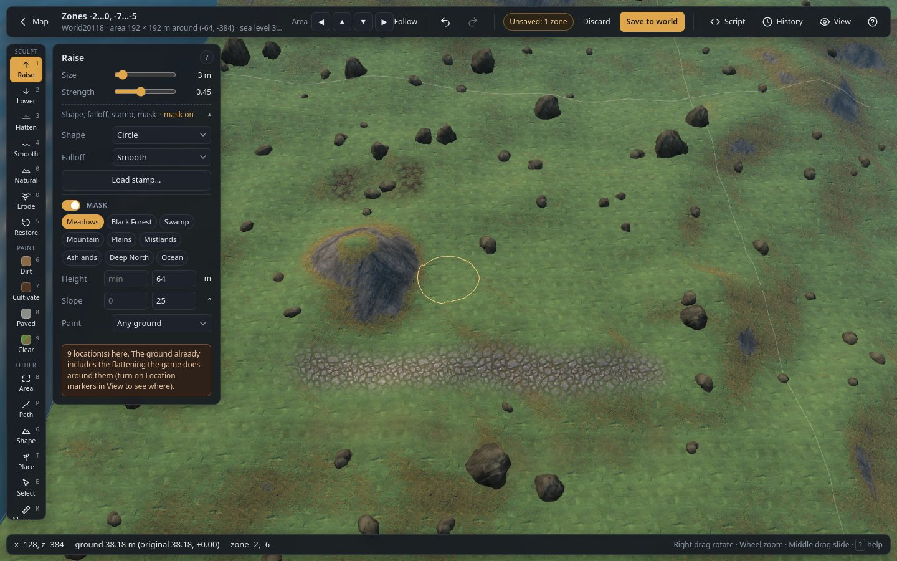

# Mask

The Mask limits a tool to the ground that matches **all** of its settings, like WorldEdit masks or
WorldPainter filters. It works with the ground brushes, Path, Shape, the Area tool's actions and Place.
Switch it on with the **Mask** box on its card, next to the tool panel; its settings open below it.

## Controls

| Control | What it does |
|---|---|
| **Mask** switch | On: the tool only changes matching ground. Off: no limit. |
| **Biome chips** | Only these biomes. None picked = every biome. |
| **Height** min / max | Only ground between these heights (m). Leave a box empty for no limit. **Alt + Shift + click** the ground fills the range around that spot (±2 m). |
| **Slope** min / max | Only ground between these steepnesses (degrees). Leave a box empty for no limit. A maximum of 0 lets only perfectly flat ground through. |
| **Paint** | Only ground with this paint: **Any ground**, **Only unpainted**, **Only painted**, **Only dirt**, **Only cultivated**, **Only paved**. |

A red warning appears under the settings when they let (almost) nothing through, such as a maximum
slope of 0° or a minimum above the maximum.

## How it is judged

During a brush stroke the mask looks at the ground **as it was when the stroke started**. So a
Raise stroke on ground below the height limit keeps rising past it until you let go, and a
stroke that changes the slope does not switch itself off halfway.

If a stroke changes nothing because the mask leaves everything out, the status bar says so.
