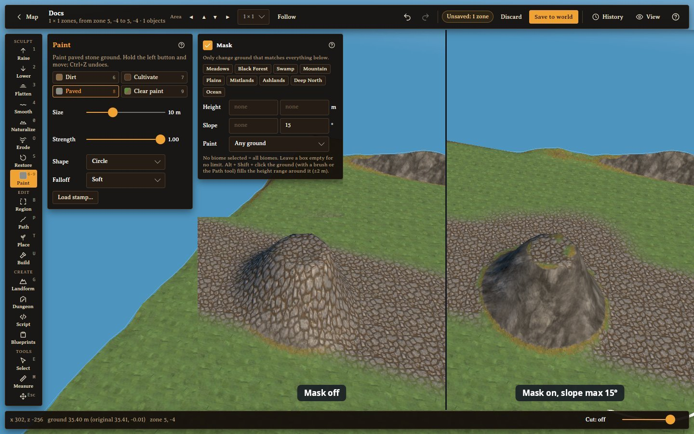
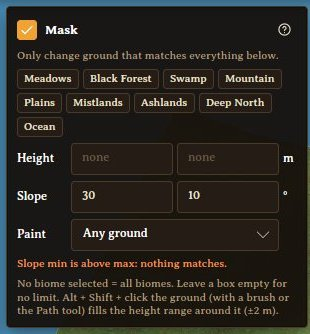

# Mask

Make a tool change only the ground you choose, by biome, height, slope or paint: pave only the flat parts of a hill,
level a valley floor without touching its sides, plant only on unpainted ground.

**Where:** the **Mask** card next to the tool's panel · **Key:** none (`Alt`+`Shift`+click sets a height range) ·
**Works in:** saved worlds, live

*The same wide stroke of Paved paint across a mound. Left, Mask off: everything is paved. Right, Mask on with slopes
under 15°: the flat ground is paved, the mound's steep sides are not. The Mask card is next to the tool panel.*

The Mask works with the sculpt brushes and the Paint brush, [Landform](landform.md),
[Path](path.md), the [Region](area.md) tool's actions, pasting and [Place](place.md). It does not hold
[Build](build.md) back: a piece goes where you point.

## Use it

1. Choose a tool that uses the Mask. The **Mask** card shows next to its panel.
2. On the card, tick **Mask**. Its settings open below it.
3. Set the biomes, height, slope and paint you want. Leave a setting empty to not limit by it.
4. Use the tool as usual: it changes only the ground that matches every setting.
5. When you are done, untick **Mask**. It stays on, with its settings, when you change tools.

## Settings

| Setting | What it does |
|---|---|
| **Mask** | On: the tool changes only ground that matches everything below. Off: no limit. |
| Biome chips | **Meadows**, **Black Forest**, **Swamp**, **Mountain**, **Plains**, **Mistlands**, **Ashlands**, **Deep North**, **Ocean**: only these biomes. None picked: every biome. |
| **Height** min / max | Only ground between these heights (m; the sea is at 30 m). Leave a box empty ("none") for no limit on that side. |
| **Slope** min / max | Only ground between these steepnesses, 0° to 90°. A maximum of 0 lets only perfectly flat ground through. |
| **Paint** | **Any ground**, **Only unpainted**, **Only painted**, **Only dirt**, **Only cultivated** or **Only paved**. |

An orange warning shows under the settings when they let nothing through: a maximum slope of 0°, or a minimum above
the maximum.

*Slope min 30° is above max 10°, so the card warns in orange: "Slope min is above max: nothing matches."*

### No limit, on the same card

Under the Mask, the card holds the other setting every ground tool shares:

| Setting | What it does |
|---|---|
| **No limit: past the game's ±8 m** | On: the ground tools go up to 400 m from the generated ground, not just the game's 8 m. One switch for the sculpt brushes, [Landform](landform.md) (its formulas and pictures), [Path](path.md) and [Region](area.md); it stays on until you switch it off, and is off each time the editor starts. See [No limit](terrain.md#no-limit). |

It is not part of the Mask (it works with the Mask on or off), and the card shows it only with the tools it governs:
not with the Paint brush and [Place](place.md), which move no ground. A Landform mountain always goes past the
limit, whatever the switch says.

## Shortcuts

| Key or mouse | What it does |
|---|---|
| `Alt`+`Shift`+click the ground | With a sculpt or paint brush, or the Path tool: turns the Mask on and fills **Height** from 2 m below to 2 m above that spot. Handy to work on one terrace or one shore line only. |

## Tips and limits

- **The Mask has no soft edge.** Each ground point (one per metre) matches or not, so sculpting with it can leave a
  step where matching ground meets the rest, most of all with Raise, Lower and a [Landform](landform.md). Go over
  the step with the **Smooth** brush afterwards, with the Mask off.
- **During a brush stroke the Mask looks at the ground as it was when you pressed the button.** A Raise stroke under
  a height limit keeps rising past it until you let go. One-click edits (Landform, Path, Region,
  paste) look at the ground just before them.
- **Biome is the biome the world generated** there. Reshaping the ground does not change it.
- **Paint:** ground wiped with **Clear paint** counts as unpainted. **Only dirt**, **Only cultivated** and
  **Only paved** need that paint to be at least half of the colour.
- **Nothing changed?** The status bar says "Nothing changed: the Mask leaves out all the ground under the brush (check
  its height, slope, biome and paint settings)."
- **A paste obeys the Mask too, though the card is not shown while you paste.** A Mask left on limits the ground
  the paste shapes (its objects all go in). Untick **Mask** before you copy and paste if you want the whole ground.
- **The Mask is a setting, not a change**: it is not undone with `Ctrl+Z` and not saved in the world. It is off, its
  boxes empty, each time the editor starts.

Ideas:

- To pave a path only on the flat parts of a hillside, set **Slope** max and use the Path tool's **Paint paved**.
- To plant only on unpainted or only on cultivated ground, set **Paint** and use [Place](place.md).
- To level the bottom of a valley without touching its sides, set **Height** max a little above the valley floor and
  use **Flatten** or the [Region](area.md) tool.

## Related

- [Clear trees and rocks, level a building site](guides/clear-an-area.md)
- [Plant a forest, a field or a hedge](guides/plant-a-forest.md)
- [Sculpt and paint](terrain.md), [Path](path.md), [Region](area.md)
- [How the mask judges the ground](concepts/ground-limits.md#how-the-mask-judges-the-ground)
