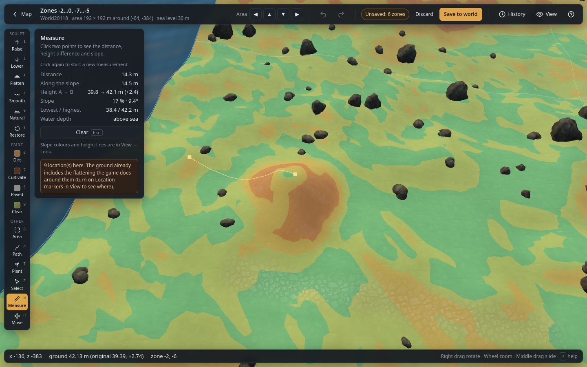

# Measure and overlays (`M`)

## Measuring tape

1. Choose **Measure** (`M`).
2. Click a first point on the ground, then a second point. Before the second click, the line
   follows the cursor.
3. Click again to start a new measurement; **Clear (Esc)** removes it.

The line follows the ground, so it shows the profile between the points. The panel shows:

| Value | Meaning |
|---|---|
| **Distance** | Straight distance on the map (m). |
| **Along the slope** | Distance including the height difference (m). |
| **Height A → B** | Ground height at both points and the difference. |
| **Slope** | Average slope between the points, in % and in degrees. |
| **Lowest / highest** | Lowest and highest ground along the line. |
| **Water depth** | How deep the lower point is under the sea, or "above sea". |

## Ground overlays

In the View panel, under **Ground (game look)**:

| Control | What it does |
|---|---|
| **Slope colours** | Colours the ground by steepness (needs **Game look**): green under 10°, yellow-green 10–20°, yellow 20–30°, orange 30–45°, red above 45°. |
| **Height lines every** *N* m | Draws contour lines at the chosen height step (1, 2, 5 or 10 m); every fifth line is darker. |

Both stay on while you use other tools, which helps when flattening a building site or planning a
ramp.
