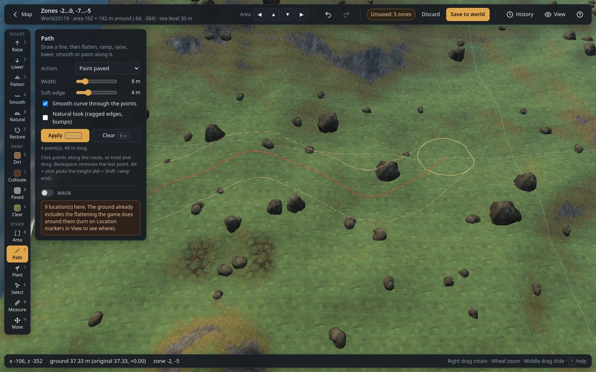

# Path (`P`)

Draw a line, then change the ground along it: a level road, a ramp up a hill, a raised causeway, a
ditch, or a painted track.

## How to use it

1. Choose **Path** (`P`).
2. **Click points** along the route, or **hold and drag** to draw it freely. Before you click, a
   circle under the cursor shows the path's width (and a thinner one its soft edge), and once there
   are points, the stretch the next click adds. The red line is the centre; the light band and its
   edges show the full width, the thin outer lines the soft edges.
3. **Fine-tune it**: drag a point (the dots on the line) to move it, drag the line between two points
   to add a point there and move it, **Ctrl + click** a point to remove it.
4. Pick an **Action** and its settings.
5. Press **Apply** (`Enter`). The line stays, so you can apply a second action to it (for example
   flatten, then paint paved), or move its points and apply again.
6. **Clear** (`Esc`) removes the line. **Backspace** removes the last point.

## Controls

| Control | What it does |
|---|---|
| **Action** | What happens along the line: **Flatten to height**, **Ramp (start → end)**, **Raise by**, **Lower by**, **Smooth**, **River / canal (water)**, **Cave (dig and roof)**, **Paint dirt** / **paved** / **cultivated**, **Clear paint**. |
| **Width** | Width of the path (m). |
| **Soft edge** | Width of the blend on each side (m), so the path joins the ground around it smoothly. At **0** the edge is as sharp as the ground allows, and the points the edge line crosses get a share of the change, so the edge follows the line straight (a trench with steep, straight sides). |
| **Height** | Flatten to height: the height of the path (m). **Alt + click** the ground picks it. |
| **Amount** | Raise by / Lower by: how much (m). |
| **Start**, **End** | Ramp: the height at the first and at the last point (m). **Alt + click** picks the start, **Alt + Shift + click** the end. The ramp rises evenly along the length of the line. |
| **Depth** | River / canal (water): how deep the bed is below sea level in its middle (m), so it fills with water. The bed rises to the waterline at the path's **Width**, and the **Soft edge** makes the banks. It only digs: ground already lower stays as it is. The ±8 m limit applies, so a river through high ground stops at it (the status bar says so); bring the ground down near the sea first, or follow low ground. |
| **Smooth curve through the points** | On: a smooth curve through your points. Off: straight lines between them. |
| **Natural look (ragged edges, bumps)** | Ragged edges, a width that varies along the way, and small bumps, so the path looks worn rather than tool-made. Its **Bumps** and **Bump size** are the Naturalize brush's, and **New pattern** there changes the pattern. |
| **Apply (Enter)** | Does the action along the line. One undo step. |
| **Clear (Esc)** | Removes the line. |

The panel shows how many points the line has and how long it is. The [Mask](masks.md) applies.

## Cave

The **Cave** button on the tool rail opens the Path tool on its **Cave (dig and roof)** action. Draw
the cave's line and press **Apply**: it digs a trench along it, with a slope down at each end as
an entrance, and roofs it over with the game's big boulders. Valheim's ground cannot overhang (one
height per point), so a cave is always rock over dug ground, like the game's own.

| Control | What it does |
|---|---|
| **Preset** | **Tunnel** (narrow, just high enough to walk), **Cave**, or **Cavern** (a wide hall): width, wall slope, depth and headroom to start from. **Randomize** changes them a little and rolls new boulders. |
| **Width**, **Soft edge** | The floor's width, and how far the walls slope out (m). |
| **Depth** | How far below the ground the floor is in the middle (m). Past 8 m needs **No limit** (in the brush options). |
| **Headroom** | The height inside, from the floor to the rock (m). The roof goes only where the cave is deeper than this by 1.5 m, so the entrances stay open. |
| **Roof** | The boulders: **By biome** (heath rocks in the Plains, mountain rocks in the Mountains, coast rocks by the sea, forest rocks elsewhere), or one kind. |

The boulders are turned upside down, so their flat side makes an even ceiling; each is turned,
tilted and sized at random and set by its real shape to clear the headroom. More are added until
the floor is covered, and the walls rise into the rock so no daylight comes in at the sides (within
the ±8 m: the message says if some points could not reach). On top, the roof shows as a rocky
outcrop. A line drawn as a closed loop makes a ring-shaped cave with one entrance. Trees and rocks
in the trench are taken away. Players can mine the boulders with a pickaxe, like any boulder.
