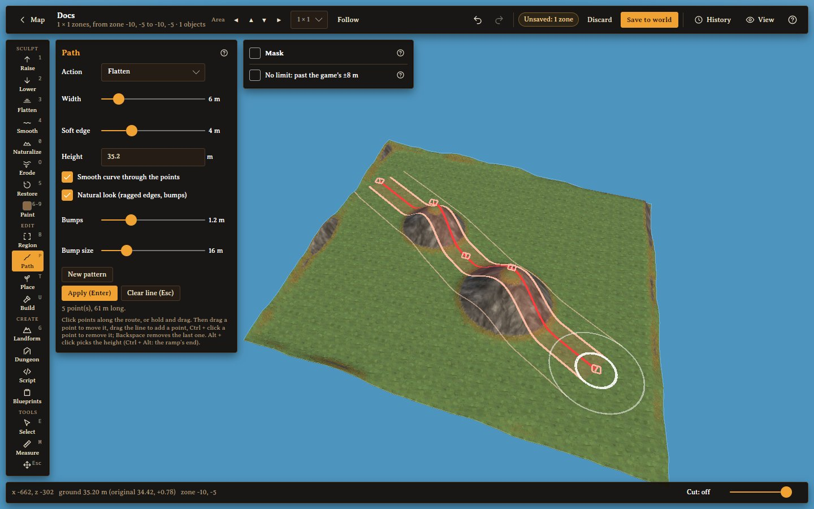
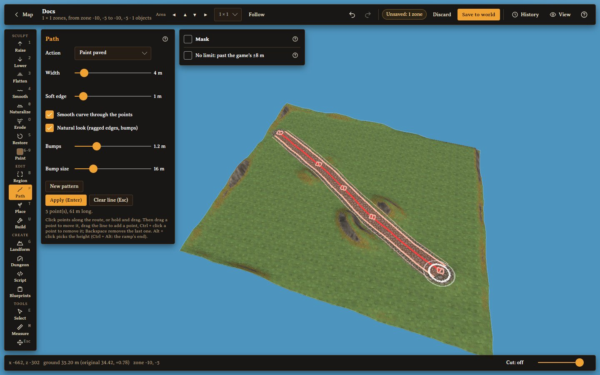
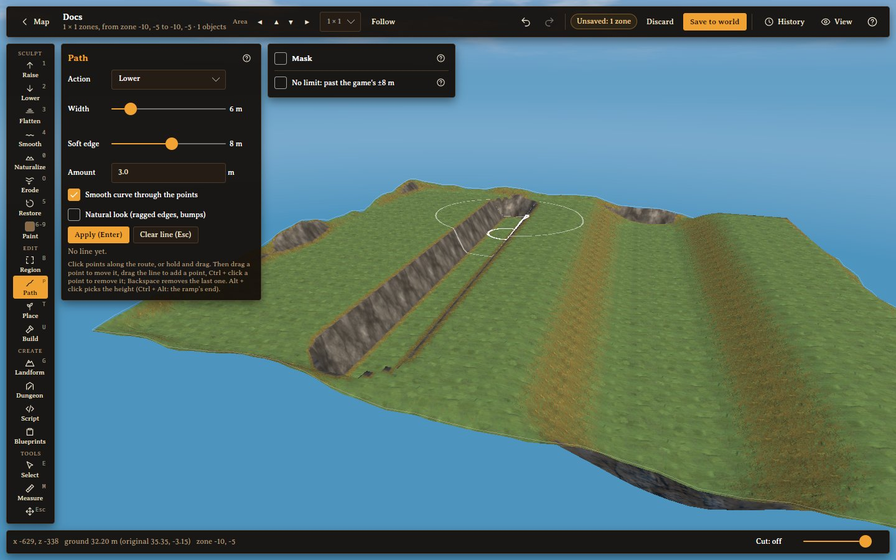
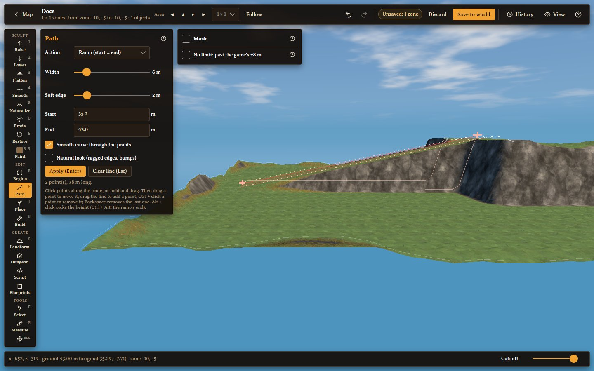
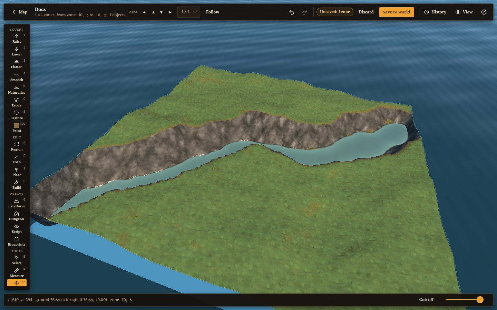

# Path

Draw a line, then flatten, ramp, raise, lower, smooth, dig or paint the ground along it: roads, ramps,
causeways, ditches and rivers.

**Where:** tool rail, **EDIT** section · **Key:** `P` · **Works in:** saved worlds, live

*A line of five points drawn over two mounds, with **Flatten** chosen and its **Height** taken from the flat
ground with `Alt`+click. Nothing has changed yet: the band shows the path's width and soft edges until you press
**Apply (Enter)**; the circle at the last point is the pointer's.*

## Use it

1. In the tool rail, click **Path** (`P`).
2. Click points along the route, or hold and drag to draw it freely. Before you click, a circle shows the path's
   width; once there are points, the band shows its width and soft edges.
3. Optional: fine-tune the line. Drag a point to move it, drag the line between two points to add a point there,
   `Ctrl`+click a point to remove it, `Backspace` to remove the last one.
4. In the panel, choose an **Action** and set its settings.
5. Press **Apply (Enter)**. The change is one undo step, named after the action ("Path: Flatten").
6. Optional: choose another action and apply it to the same line (flatten, then pave), or move its points and apply
   again. The line stays until you press **Clear line (Esc)**.

The panel shows how many points the line has and how long it is.

*The line from the first picture, same camera: **Flatten** cut a level road through both mounds, then
**Paint paved** with **Width** 4 m and **Soft edge** 1 m paved its middle. The line stays for the next action.*

## Settings

| Setting | What it does |
|---|---|
| **Action** | What happens along the line (see [Actions](#actions)). |
| **Width** | Width of the path, 1 to 40 m (default 8 m). The action works fully across it. |
| **Soft edge** | How far the change fades out on each side, 0 to 15 m (default 4 m), so the path blends into the ground. At **0** the edge is sharp: a trench with straight, steep sides. |
| **Height** | **Flatten**: the height of the path (m). `Alt`+click the ground picks it. |
| **Amount** | **Raise** / **Lower**: how much (m, default 2). |
| **Start**, **End** | **Ramp**: the height at the first and the last point (m). See [Ramp](#ramp). |
| **Depth** | **River / canal**: how deep the bed is below sea level in its middle (m, default 2). |
| **Smooth curve through the points** | On (default): a smooth curve through your points. Off: straight lines between them. |
| **Natural look (ragged edges, bumps)** | A width that varies along the way (up to 45% either way), ragged edges and small bumps on the surface, so the path looks worn rather than tool-made. |
| **Bumps**, **Bump size**, **New pattern** | **Naturalize** and **Natural look**: how tall and how wide the bumps are, and another random pattern for them. They are the [Naturalize](terrain.md#naturalize) brush's: set here, there or in the [Region](area.md) tool, they are the same values. |
| **Rest angle** | **Erode**: the steepest slope that stays put, 10° to 60° (default 33°). The [Erode](terrain.md#erode) brush's, the same value. |

*Two straight lines on flat ground, each **Lower** by 3 m with **Width** 6 m, seen along them. Left: **Soft edge** 0,
a trench with steep, straight walls. Right: **Soft edge** 8 m, the banks slope gently into the ground.*

## Actions

| Action | What it does |
|---|---|
| **Flatten** | Levels the path to **Height**: a road, a terrace along a slope, a causeway over a dip. |
| **Ramp (start → end)** | A slope that rises or falls evenly from **Start** to **End**. |
| **Raise** | Lifts the path by **Amount**, keeping its ups and downs: a bank, a dyke. |
| **Lower** | Digs the path down by **Amount**: a ditch, a sunken lane. |
| **Smooth** | Evens out the ground along the path: each point moves towards the average of the ground within 3 m. Apply it again for more. |
| **Naturalize** | Natural-looking bumps along the path, over the ground's broad shape, with **Bumps**, **Bump size** and the pattern: what a flattened or raised path needs to look like ground again. |
| **Erode** | Weathers the ground along the path in one go: slopes settle to **Rest angle**, rain cuts gullies and leaves fans, slopes settle again. |
| **Restore** | Back to how the world generated it along the path, paint removed, ground raised or dug with No limit included: undoes a road or a ditch long after the undo history is gone. |
| **River / canal (water)** | Digs a bed below sea level, so it fills with water (see [River or canal](#river-or-canal)). |
| **Paint dirt**, **Paint paved**, **Paint cultivated** | Paints the path, full colour across the width, blending out over the soft edge. |
| **Clear paint** | Paints plain biome ground along the path (see [Paint brush](terrain.md#paint-brush)). |

**Flatten**, **Raise**, **Lower**, **Smooth**, **Naturalize**, **Erode**, **Restore** and the paints are the same
actions as the [brushes](terrain.md) and the [Region](area.md) tool's ground actions, under the same names: a brush says
where by its stroke, the Region tool by a selection, the Path tool by a line, and the ground changes the same way.

### Ramp

*A ramp of two points seen from the side, from the ground at its foot (**Start** 35.2 m) to the top of a pad
raised 8 m (**End** 43 m). It rises evenly the whole way.*

Until you type a height or pick one, **Start** and **End** follow the ground under the first and last points, so
moving the ends updates them. `Alt`+click the ground picks the start height, `Ctrl`+`Alt`+click the end height.
**Clear line (Esc)** lets them follow the ground again. A winding ramp has the same slope all along.

### River or canal

*A river dug across the zone with **River / canal (water)**: the sea fills it.*

Valheim has no flowing water: the water in rivers is the sea, at the same level (30 m) everywhere. So a river only
has water where its bed is below sea level. The action digs a U-shaped bed **Depth** below sea level in its middle,
rising to the waterline at the **Width**; the **Soft edge** makes the banks. It only digs: ground already lower stays
as it is, so a river can run into a lake or the sea.

Through high ground a river needs a deep cut, and the game's ±8 m limit stops it 8 m down (the status bar says so).
Bring the ground down near the sea first, follow low ground, or turn on [No limit](terrain.md#no-limit).

## Shortcuts

| Key or mouse | What it does |
|---|---|
| `P` | Choose Path. |
| Click / hold and drag | Add points / draw the line freely (a point every 2 m). |
| Drag a point / drag the line | Move the point / add a point there and move it. |
| `Ctrl`+click a point | Remove it. |
| `Backspace` | Remove the last point. |
| `Alt`+click | Pick the height (Flatten) or the ramp's start. |
| `Ctrl`+`Alt`+click | Pick the ramp's end height. |
| `Alt`+`Shift`+click | Set the [Mask](masks.md)'s height range to 2 m above and below that spot, as with a brush. |
| `Enter` | Apply the action. |
| `Esc` | Clear the line; a second `Esc` leaves the tool. |
| `Ctrl+Z` | Undo the last Apply. |

## Tips and limits

- **The [Mask](masks.md) applies to every action**, and so does the ±8 m limit unless
  [No limit](terrain.md#no-limit) is on. Where the path reaches the limit, the points turn red and the status bar says
  so. The No limit switch is on the **Mask** card next to the Path panel: one switch for every ground tool.
- **A sharp corner** needs two points close together, or **Smooth curve through the points** off: a smooth curve
  passes through every point you click.
- **Check a ramp's slope first** with [Measure](measure.md): measured from foot to top, **Slope** is what the ramp
  will give.
- **Clear line (Esc) removes only the line.** What you applied stays; `Ctrl+Z` takes back one Apply at a time.
- **The path works only inside the open area**, and never moves its outermost line of points (see
  [The locked edge](concepts/areas-and-zones.md#the-locked-edge)).

## Related

- [Make a road or a ramp up a hill](guides/make-a-road.md)
- [Dig a river or a pond](guides/make-a-river.md)
- [Ground limits](concepts/ground-limits.md)
- [Sculpt and paint](terrain.md), [Measure](measure.md)
- [How a path's edge fades](concepts/ground-limits.md#how-a-paths-edge-fades)
