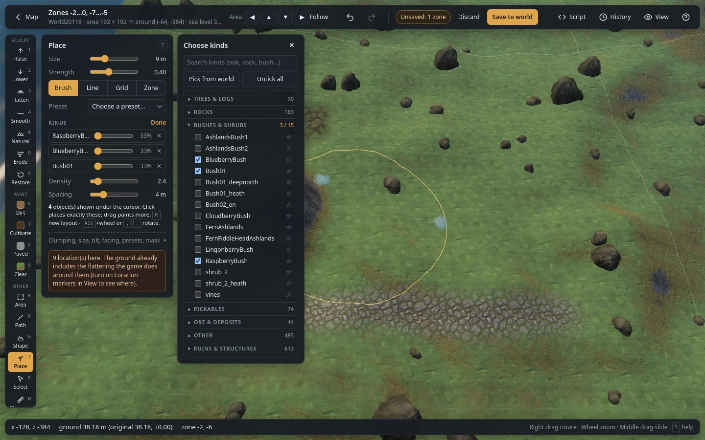
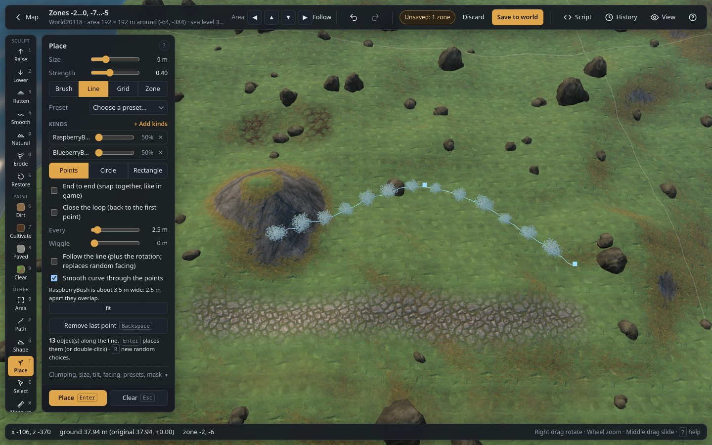
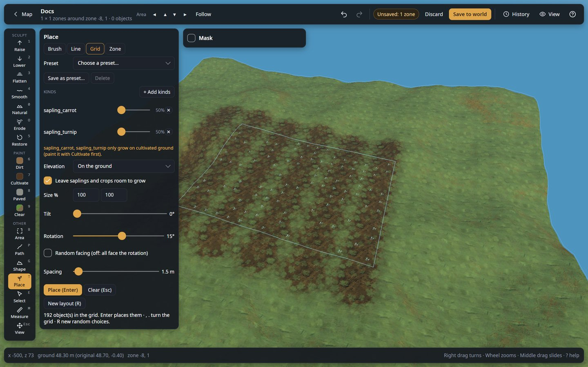
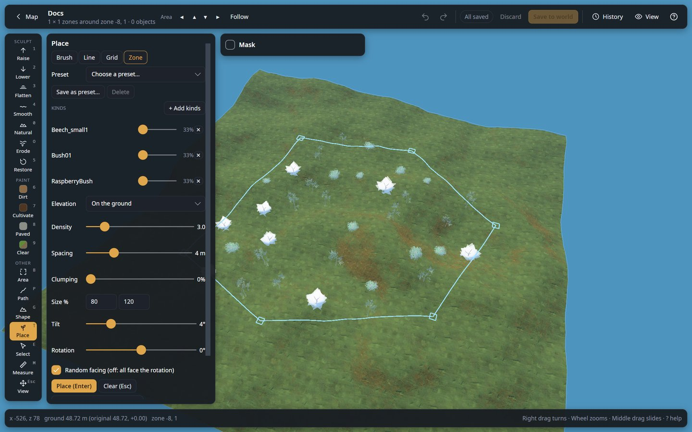

# Place (`T`)

Place trees, rocks, bushes, crops, building pieces or anything else the game has, in four
patterns. A see-through **preview** ("ghosts") always shows exactly what will be placed, so you
can see how many and how it looks before you click. Objects you placed but did not save yet have a
green dot.

## Choosing what to place

| Control | What it does |
|---|---|
| **Search** | Filters the list by name (oak, rock, turnip…). |
| **Untick all** | Unticks every kind. |
| **Pick** | Eyedropper: click an object in the world to place only its kind. **Shift + click** adds it to the ticked kinds instead. Esc cancels. |
| **Favourites** | Click the ☆ after a kind in the list to star it; starred kinds show as buttons above the list. |
| **Recent** | The last eight kinds you placed, newest first, as buttons above the list. |
| Favourite and Recent buttons | A click ticks or unticks that kind; **Shift + click** places only that kind. **all** / **none** tick or untick the whole row. Both lists are kept in this browser. |
| **Category lists** | Click a category to fold or unfold it; the number is ticked / total. |
| **Tick boxes** | Every ticked kind is used; each placement picks one of them at random. |

The list has every placeable kind in the game (about 1,500), including kinds your world has none
of yet. Creatures, dropped items and effects are left out. Kinds without an extracted model show as
dots in the preview.

## Modes

| Mode | How it works |
|---|---|
| **Brush** | The preview follows the cursor. A **click** places exactly what the preview shows; a **drag** keeps adding objects under the brush. **Shift + drag** removes the ticked kinds under the brush. |
| **Line** | Click points along a route (or hold and drag), or draw a **Circle** or a **Rectangle**. Objects go every *N* metres along it, or **end to end** like the game's hammer snaps them. |
| **Grid** | Drag a box. One object goes in the middle of each cell. |
| **Zone** | Click points around a zone (or hold and drag to draw it freely); it closes by itself. Fill it by **Scatter** (random spots) or **Grid** (one per cell). |

In Line, Grid and Zone, press **Place** (`Enter`, or double-click the last point of a line or
zone); **Clear** (`Esc`) removes the shape, **Backspace** removes the last point.

## Fences and walls: end to end

In **Line** mode, **End to end** places pieces so that each one starts exactly where the last one ends,
turned along the line, like the game's hammer snaps them: a fence, a stake wall, a row of walls or
floors in a few clicks. The pieces' own snap points (from the game) give their length; other kinds
use the length of their model. Ticking several kinds alternates them. End to end switches itself on
when every ticked kind is a piece the game snaps (fences, walls, stakes, floors...) and off for other
kinds, until you change it yourself.

| Control | What it does |
|---|---|
| **Points** | Click points along the way, or hold and drag to draw freely. Then drag a point to move it, drag the line to add a point, **Ctrl + click** a point to remove it. **Close the loop** goes back to the first point at the end. |
| **Circle** | Press at the centre and drag out to the size. With End to end the size snaps so that whole pieces close the ring. |
| **Rectangle** | Press at one corner and drag to the opposite one. With End to end the sides snap to whole pieces, and each side is filled from its corner, so the corners meet exactly. |

The preview shows the pieces and the size; when a line does not end on a whole piece, it says how
much of it is left. **Enter** places them (one undo step).

On a slope the pieces stay level, each standing on the ground where it is (on the lowest point under
it, so it never floats): every piece is a little higher or lower than the last one, touching it, like
a fence going up a hill. For one straight, even fence, flatten the ground along the line first (Path
tool, Flatten).

## Settings

| Control | Modes | What it does |
|---|---|---|
| **Size** (brush) | Brush | Brush radius (m). |
| **Density** | Brush, Zone scatter | Objects per 100 m². |
| **Spacing** | Brush, Zone scatter | Minimum distance between objects (m), also from objects already there. |
| **Size** min / max (%) | All | Each object gets a random size between the two, in % of its normal size. |
| **Tilt** | All | Random lean of each object, up to this many degrees. |
| **Rotation** | All | Turns the preview layout and every object's facing (degrees). `,` `.` or Alt + wheel change it by 1° (Shift: 15°). |
| **Random facing** | All | On: each object faces a random direction. Off: they all face the Rotation. |
| **One at a time** | Brush | Places one object exactly under the cursor per click; only an object right on that spot blocks it. |
| **Leave saplings and crops room to grow** | All, only shown when a sapling or crop is ticked | Keeps saplings and crops at least their in-game grow radius (0.5 m for crops, 2–3 m for tree saplings) away from everything, including each other, so they can grow. Off: place them as tightly as you like. |
| **Every** | Line | Distance between two objects along the line (m). |
| **Wiggle** | Line | Random sideways offset from the line, up to this many metres. |
| **Follow the line** | Line | On (the default): each object follows the line (plus the Rotation): a piece lies along it, end to end, other kinds face along it. Off: random facing. Circles and rectangles always follow their outline. |
| **Smooth curve through the points** | Line | A smooth curve instead of straight segments. |
| **Scatter** / **Grid** | Zone | How the zone is filled. |
| **Cell** | Grid, Zone grid | Size of each cell (m). |
| **Place** (`Enter`) | Line, Grid, Zone | Places what the preview shows. |
| **Clear** (`Esc`) | Line, Grid, Zone | Removes the drawn shape. |
| **New layout** (`R`) | All | New random positions, kinds, sizes and facings for the preview. |

In Grid and Zone mode, `,` `.` and Alt + wheel **turn the whole box or zone** (with its cells and the
objects' facing) instead of only the facing.

## Rules it follows

- **Not under water**, except kelp and seaweed.
- **The Mask** applies (biome, height, slope, paint).
- **Crops need cultivated ground** in the game. When a ticked crop needs it, the panel says so:
  paint the ground with **Cultivate** first.
- In Line, Grid and Zone (grid) modes, existing objects do not block placement, only an object right
  on the spot (0.3 m), so you cannot place the same pattern twice by accident.
- New objects are fresh: for a kind the world already has, a copy of one with nothing unique kept
  (no contents, no health); for a kind it does not have, a new object exactly like the game makes
  one.
