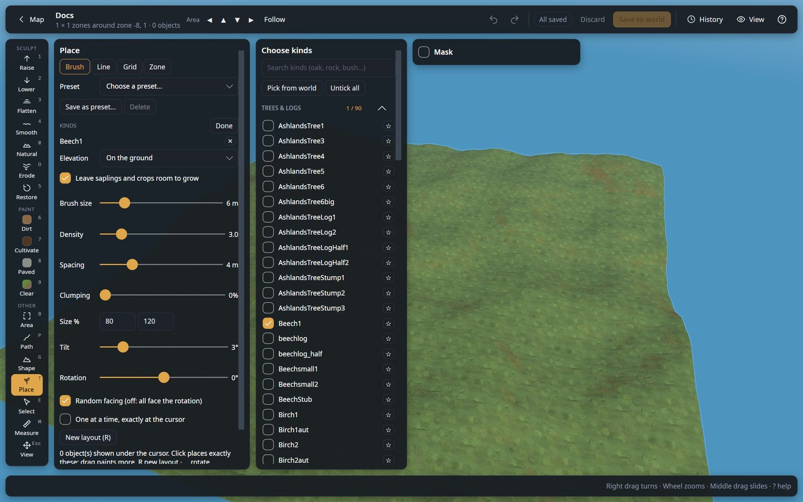

# Place (`T`)

Place trees, rocks, bushes, crops, building pieces or anything else the game has, in four
patterns. A see-through **preview** ("ghosts") always shows exactly what will be placed, so you
can see how many and how it looks before you click.

## Choosing what to place

Under **KINDS** the panel lists the kinds you chose, each with a ✕ to drop it. **+ Add kinds** opens
**Choose kinds**, a list of every kind in a card beside the panel; **Done** closes it.

| Control | What it does |
|---|---|
| **Search kinds** | Filters the list by name (oak, rock, bush…). Searching opens every category with a match. |
| **Tick boxes** | Every ticked kind is used; each placement picks one of them at random. The list is grouped by kind of object (trees, rocks, bushes, pickables…), each category folding open or shut with a click on its name; the number after it is how many of its kinds are ticked, of how many. Which categories are open is remembered (Trees at first). |
| **Weights** | In the panel, with two or more kinds chosen, a slider per kind (1–10) sets how often it is used, with its share: Beech 3, Birch 1 gives three beeches for one birch. Remembered. |
| **Preset** | Loads a mix: its kinds with their weights, and its Density, Spacing, Clumping, Size, Tilt and facing. Built in: Meadows woods, Black forest, Swamp, Berry patch, Forest floor, Meadows rocks. Kinds a world cannot place are left out. |
| **Save as preset…** / **Delete** | Saves the chosen kinds, weights and those settings under a name (kept in the editor's data folder); Delete removes one of yours, after asking. |
| **Pick from world** | Eyedropper: click an object in the world to place only its kind; **Shift + click** adds it to the ticked kinds (or takes it away when it is ticked). `Esc` cancels. |
| **Untick all** | Unticks every kind. |
| **Favourites** | Click the ☆ after a kind in the list to star it; starred kinds show as buttons above the list. |
| **Recent** | The last eight kinds you placed, newest first, as buttons above the list. |
| Favourite and Recent buttons | A click ticks or unticks that kind; **Shift + click** places only that kind. **all** / **none** after the row's name tick or untick every kind of the row. Both lists are kept in the editor's data folder. |

The list has every placeable kind in the game (about 1,500), including kinds your world has none
of yet. Creatures, dropped items and effects are left out. Kinds without an extracted model show as
boxes in the preview.

## Modes

| Mode | How it works |
|---|---|
| **Brush** | The preview follows the cursor. A **click** places exactly what the preview shows; a **drag** keeps adding objects under the brush. **Shift + drag** removes the ticked kinds under the brush. |
| **Line** | Click points along a route (or hold and drag), or draw a **Circle** or a **Rectangle**. Objects go every *N* metres along it, or **end to end** like the game's hammer snaps them. |
| **Grid** | Drag a box. One object goes in the middle of each cell; the box gets as many whole cells as fit best (at least one), centred in it. |
| **Zone** | Click points around a zone (or hold and drag to draw it freely); it closes by itself. Drag a point to move it, drag the outline to add a point, **Ctrl + click** a point to remove it. Objects go at random spots inside it (**Density**, **Spacing**). |

In Line, Grid and Zone, press **Place (Enter)** (or double-click the last point of a line or
zone); **Clear (Esc)** removes the shape, **Remove last point (Backspace)** takes back the last
point you clicked.

## Fences and walls: end to end

In **Line** mode, **End to end (snap together, like in game)** places pieces so that each one starts exactly where the last one ends,
turned along the line, like the game's hammer snaps them: a fence, a stake wall, a row of walls or
floors in a few clicks. The pieces' own snap points (from the game) give their length; other kinds
use the length of their model. Ticking several kinds alternates them. End to end switches itself on
when every ticked kind is a piece the game snaps (fences, walls, stakes, floors...) and off for other
kinds, until you change it yourself.

| Control | What it does |
|---|---|
| **Points** | Click points along the way, or hold and drag to draw freely. Then drag a point to move it, drag the line to add a point, **Ctrl + click** a point to remove it. **Close the loop (back to the first point)** goes back to the first point at the end. |
| **Circle** | Press at the centre and drag out to the size. With End to end the size snaps so that whole pieces close the ring. |
| **Rectangle** | Press at one corner and drag to the opposite one. With End to end the sides snap to whole pieces, and each side is filled from its corner, so the corners meet exactly. |
| **Layers** | With End to end: the line stacked this many pieces high, each layer on top of the one below (a wall 3 high, a double fence). |

A line that starts within 1 m of a piece already there continues it: it starts at that piece's snap
point and stays at its level.

## Building pieces: snapping and elevation

When a ticked kind is a building piece (it has snap points: walls, fences, floors, beams...), the
Brush places one at a time under the cursor, and **Snap to pieces already there** (on by default)
locks it onto the pieces around it, like the game's hammer:

| Control | What it does |
|---|---|
| **Beside** | The piece goes end to end with the piece next to the cursor, at its level (bottom with bottom, top with top), in whichever quarter turn meets best. |
| **On top** | The piece sits on top of the piece under the cursor, its bottom on that piece's top. |
| Facing | A snapped piece faces like the piece it attaches to; **Rotation** turns it from there in quarter turns. |

The preview says what it snapped to. Untick **Snap to pieces already there** to place freely.

**Elevation** works for every kind and mode:

| Control | What it does |
|---|---|
| **On the ground** | Each object stands on the ground where it goes (a piece by its bottom: walls have their middle at their origin). |
| **Above the ground** | Each object stands **Height** metres above the ground under it. |
| **At one height** | Every object at the same **Height** (its bottom there), whatever the ground does: a level wall over uneven ground, a floor for a platform. |
| `PgUp` / `PgDn` | Up or down by 0.5 m (`Shift`: 0.1 m); from On the ground it starts lifting above it. |
| `Alt` + click | At one height: the top of the piece clicked (to build on it), or the ground there. |

Objects placed above the ground may stand over water (the under-water check is only for objects on
the ground).

The preview shows the pieces and the size; when a line does not end on a whole piece, it says how
much of it is left. **Enter** places them (one undo step).

On a slope the pieces stay level, each standing on the ground where it is (on the lowest point under
it, so it never floats): every piece is a little higher or lower than the last one, touching it, like
a fence going up a hill. For one straight, even fence, flatten the ground along the line first (Path
tool, Flatten).

## Settings

The panel shows the settings of the chosen mode. The [Mask](masks.md) is on its own card next to it.
The Place tool's settings are remembered between runs.

| Control | Modes | What it does |
|---|---|---|
| **Brush size** | Brush | Brush radius (m); `[` `]` change it. |
| **Density** | Brush, Zone | Objects per 100 m². |
| **Spacing** | Brush, Zone | Minimum distance between objects (m), also from objects already there. |
| **fit** | Brush, Zone, Grid, Line (not End to end) | Shown when a ticked kind is wider (at its largest size) than the mode's spacing, saying how wide it is: they would overlap. **fit** sets the spacing (Spacing, Every or the grid's Spacing) to it, to the next half metre. |
| **Clumping** | Brush, Zone | Gathers the objects in groves with clearings between them, following a noise pattern fixed to the world (so strokes next to each other match). 0 %: an even spread; the higher, the fewer and smaller the groves. **New layout** (`R`) moves them. |
| **Patch size** | Brush, Zone (with Clumping) | How big the groves and clearings are (m). |
| **Size %** min / max | All | Each object gets a random size between the two, in % of its normal size. |
| **Tilt** | All | Random lean of each object, up to this many degrees. |
| **Rotation** | All | Turns the preview layout and every object's facing (degrees). `,` `.` or Alt + wheel change it by 1° (Shift: 15°). |
| **Random facing (off: all face the rotation)** | All | On: each object faces a random direction. Off: they all face the Rotation. |
| **One at a time, exactly at the cursor** | Brush | Places one object exactly under the cursor per click; only an object right on that spot blocks it. |
| **Leave saplings and crops room to grow** | All, only shown when a sapling, a crop or a tree that grows from one is ticked | Keeps saplings and crops at least their in-game grow radius (0.5 m for crops, 2–3 m for tree saplings) away from everything, including each other, so they can grow. Grown crops (Pickable_Carrot...) and trees that grow from saplings (Beech1, Oak1...) keep the room their sapling needs, like a planted field or orchard. Bushes do not grow from anything in the game: use **Spacing** for them. Off: place them as tightly as you like. |
| **Every** | Line | Distance between two objects along the line (m). |
| **Wiggle** | Line | Random sideways offset from the line, up to this many metres. |
| **Follow the line (plus the rotation; replaces random facing)** | Line | On (the default): each object follows the line (plus the Rotation): a piece lies along it, end to end, other kinds face along it. Off: random facing. Circles and rectangles always follow their outline. |
| **Smooth curve through the points** | Line | A smooth curve instead of straight segments. |
| **Spacing** | Grid | Space between objects, centre to centre (m): the size of each cell. |
| **Place (Enter)** | Line, Grid, Zone | Places what the preview shows. |
| **Clear (Esc)** | Line, Grid, Zone | Removes the drawn shape. |
| **New layout (R)** | All | New random positions, kinds, sizes and facings for the preview. |

In Grid and Zone mode, `,` `.` and Alt + wheel **turn the whole box or zone** (with its cells and the
objects' facing) instead of only the facing.

## Rules it follows

- **Not under water**, except kelp and seaweed.
- **The Mask** applies (biome, height, slope, paint).
- **Crops need cultivated ground** in the game. When a ticked crop needs it, the panel says so:
  paint the ground with **Cultivate** first.
- In Line and Grid modes, existing objects do not block placement, only an object right
  on the spot (0.3 m), so you cannot place the same pattern twice by accident.
- New objects are fresh: for a kind the world already has, a copy of one with nothing unique kept
  (no contents, no health); for a kind it does not have, a new object exactly like the game makes
  one.
