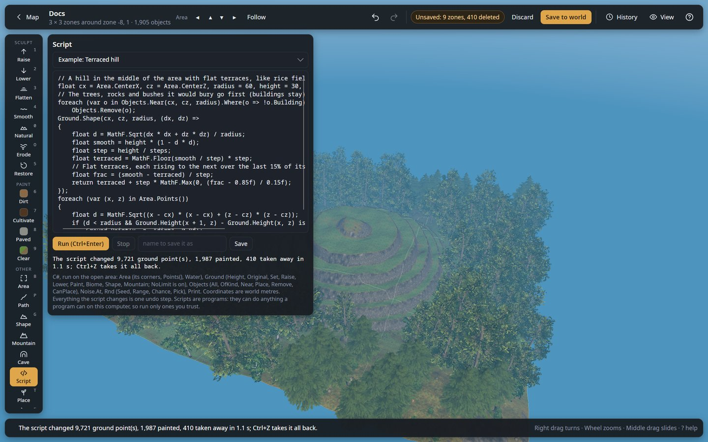

# Script



Write a few lines of C# and the editor runs them on the open area: shape the ground, paint it, place
and remove objects. Anything the other tools do by hand, a script can do by rule and at once: a
mountain range across the area, a hundred boulders where the noise says so, a forest only on gentle
slopes, terraces, a canyon with a river, a flat paved square at exactly the average height... and
whatever you can think of.

You do not need to install anything: the editor compiles the script itself. If you have never
written C#, start from an example and change its numbers; the [recipes](#recipes) below show the
common patterns.

## How to use it

1. Open an area in the 3D editor. A script works on the **open area** (the zones you see).
2. Choose **Script** on the tool rail.
3. Pick an **example** in the list (or a script you saved), or write your own in the code box.
4. Press **Run** (or **Ctrl + Enter** in the code box). The script runs in the background; the box
   under it says what it changed, or what went wrong.
5. Look at the result. **Ctrl + Z** takes the whole run back in one step; run it again with other
   numbers until you like it.
6. **Save to world** keeps it, like any other change.

## The panel

| Control | What it does |
|---|---|
| **List** | The examples, then your saved scripts (newest first). Picking one puts it in the code box. |
| **Code box** | The script. **Tab** indents; **Ctrl + Enter** runs it. |
| **Run (Ctrl+Enter)** | Compiles and runs the script on the open area. Everything it changes is **one undo step**. |
| **Stop** | Stops a running script; nothing it did is kept. A script also stops by itself after 2 minutes. |
| **Name** / **Save** | Saves the script under that name, to pick it again from the list later. Scripts are kept as `<name>.csx` files in the `scripts` folder of the editor's data folder (`~/.local/share/ValheimWorldEditor/scripts` on Linux, `%LOCALAPPDATA%\ValheimWorldEditor\scripts` on Windows), so you can also edit them with any text editor, or share them. |
| **Output** | What the script printed (`Print`), then what it changed, or its mistakes or error with the line they are on. |

## How a script sees the world

- **Plain C#.** A script is a list of statements run from top to bottom (C#'s top-level
  statements). It can declare variables, loops, functions and classes, and use .NET (`MathF`,
  `System.Linq`...). `using System`, `System.Linq` and `System.Collections.Generic` are already there.
- **World metres.** Every position is in metres in the world: **x** east, **z** north, the same
  numbers as the status bar's readout and the game's `pos` command. Heights are metres above the
  world's zero: the sea is at `Area.Water` (30 m).
- **One point per metre.** The ground has a point every metre. `Ground.Set(x, z, ...)` changes the
  point nearest to (x, z); `Ground.Height` reads between points smoothly.
- **The open area only.** The script sees and changes the open area, not beyond it (the outer row
  of points stays as it is, so the area joins its neighbours). Open a bigger area (up to 9 × 9
  zones) for bigger works.
- **A snapshot.** The script works on a copy of the area taken when you press Run. It sees its own
  changes as it goes (raise a point, then `Height` gives the new height), and nothing happens to the
  area until it has finished: then all of it goes in at once, as one undo step. If it fails or is
  stopped, nothing changes.
- **Past the ±8 m.** Scripts can move the ground as far as they like (`Ground.NoLimit` is on), like
  the [No limit](terrain.md#no-limit) switch and the [Mountain](terrain.md#mountain) tool: saving turns that ground into invisible
  ground discs every player's game counts as generated ground, console players too. Set
  `Ground.NoLimit = false;` to keep within the game's ±8 m of the original ground, as the hoe and
  pickaxe are.

## What a script can use

### Area

The open area.

| | |
|---|---|
| `Area.MinX`, `Area.MinZ`, `Area.MaxX`, `Area.MaxZ` | Its corners (world metres). |
| `Area.CenterX`, `Area.CenterZ` | Its middle. |
| `Area.Points()` | Every ground point of the area, as `(x, z)`, row by row: `foreach (var (x, z) in Area.Points()) { ... }`. `Area.Points(step: 4)` takes every 4th metre, for scattering things. |
| `Area.Inside(x, z)` | Whether a point is in the area. |
| `Area.Water` | Sea level (30 m). |
| `Area.WorldSeed`, `Area.World` | The world's seed (a number) and name. |

### Ground

| | |
|---|---|
| `Ground.Height(x, z)` | The ground's height there now (with the script's changes so far). |
| `Ground.Original(x, z)` | The ground before any edit: as the world generated it (and as ground discs and lifts made it). The difference with `Height` is what has been dug or built up. |
| `Ground.Set(x, z, height)` | Puts the ground point there at that height. |
| `Ground.Raise(x, z, metres)`, `Ground.Lower(x, z, metres)` | Moves it up or down by that much. |
| `Ground.Shape(x, z, radius, (dx, dz) => metres)` | Adds the metres your function gives to every point within the radius of (x, z). `dx` and `dz` are the metres from the middle: `d = MathF.Sqrt(dx * dx + dz * dz)` is the distance. Negative digs. |
| `Ground.Mountain(x, z, "Lone peak", height:, radius:, rough:, turn:, seed:)` | A mountain of the Mountain tool: `"Lone peak"`, `"Ridge"`, `"Mountain range"`, `"Mesa"`, `"Volcano"` or `"Rolling hills"`. Leave a value out for a random one of the preset; the same `seed` makes the same mountain. The trees and rocks it buries are taken away, as with the tool. |
| `Ground.Paint(x, z, "dirt")` | Paints the point: `"dirt"`, `"cultivated"`, `"paved"` or `"clear"` (back to the biome's own ground). A last number from 0 to 1 paints only partly (`0.5f`). |
| `Ground.Biome(x, z)` | The biome there: `"Meadows"`, `"BlackForest"`, `"Swamp"`, `"Mountain"`, `"Plains"`, `"Ocean"`, `"Mistlands"`, `"AshLands"` or `"DeepNorth"`. |
| `Ground.NoLimit` | On (`true`) by default: changes go past the game's ±8 m. `false`: they stop at it. |

### Objects

What stands in the area, as it was when the script started. Each object (`Obj`) has its `Prefab`
name, its position `X`, `Y`, `Z`, its `Kind` and whether it is a `Building` (a piece a player built).

| | |
|---|---|
| `Objects.All` | Every object of the area. |
| `Objects.OfKind("Trees")` | Those of a kind: `Buildings`, `Ruins`, `Trees`, `Rocks`, `Ore`, `Bushes`, `Pickables`, `Animals` (tamed), `Runestones`, `Other`. |
| `Objects.Near(x, z, radius)` | Those within the radius of a point. |
| `Objects.Remove(o)` | Takes it away. |
| `Objects.Place("Beech1", x, z, yaw:, scale:, y:)` | A new object of the game, by its prefab name (`Beech1`, `Pinetree_01`, `rock4_forest`, `piece_chest_wood`...: the names the Place tool lists). It stands on the ground as the script leaves it, unless you give a height `y`. `yaw` turns it (degrees), `scale` sizes it (`0.5f` half, `2` double; the default keeps the game's own size). Building pieces are the chosen builder's, as with the Place tool. |
| `Objects.CanPlace("Beech1")` | Whether the editor knows how to make that object. |

### Noise and random numbers

| | |
|---|---|
| `Noise.At(x, z, scale, seed)` | Smooth natural noise from about -1 to 1, the kind Valheim's own terrain is made of. `scale` is the size of its bumps in metres (default 32); another `seed` gives another pattern. Use it for anything that should vary naturally: heights, where trees grow, how wide a path is. |
| `Rnd.Seed = 42;` | Makes the random numbers below the same on every run (without it, each run differs). |
| `Rnd.Next()` | A random number from 0 to 1. |
| `Rnd.Range(min, max)`, `Rnd.Int(min, max)` | A random number in a range (`Int`: whole numbers, `max` excluded). |
| `Rnd.Chance(0.3f)` | `true` 30% of the time. |
| `Rnd.Pick("Beech1", "Oak1", "Birch1")` | One of the values, at random. |

### Printing

`Print(anything)` writes a line in the output box under the script: values, counts, what it is
doing. Handy to check numbers before changing anything: comment out the changing lines (`//`) and
print instead.

## Recipes

Each recipe is a whole script: paste it into the code box and run it on any open area.

**A round hill in the middle of the area**, 25 m high, 40 m across:

```csharp
Ground.Shape(Area.CenterX, Area.CenterZ, 40, (dx, dz) =>
{
    float d = MathF.Sqrt(dx * dx + dz * dz) / 40;   // 0 in the middle, 1 at the edge
    return 25 * (1 - d * d) * (1 - d * d);           // a smooth bell
});
```

**A lake**: dig a round hollow below sea level; the sea fills it (in Valheim, ground below 30 m is
under water):

```csharp
float cx = Area.CenterX, cz = Area.CenterZ, radius = 35;
Ground.Shape(cx, cz, radius, (dx, dz) =>
{
    float d = MathF.Sqrt(dx * dx + dz * dz) / radius;
    float bed = Area.Water - 4 * (1 - d * d);         // 4 m deep in the middle
    float now = Ground.Height(cx + dx, cz + dz);
    return d < 0.8f ? bed - now : (bed - now) * (1 - d) / 0.2f;   // a soft shore
});
```

**Pine forest only on gentle slopes**, denser where the noise is high, none in water:

```csharp
Rnd.Seed = 1;
int planted = 0;
foreach (var (x, z) in Area.Points(step: 5))
{
    float slope = MathF.Abs(Ground.Height(x + 1, z) - Ground.Height(x - 1, z)) / 2;   // rise per metre
    if (slope > 0.45f || Ground.Height(x, z) < Area.Water + 1) continue;             // about 25°, and dry land
    if (Noise.At(x, z, 50, seed: 2) < 0 || !Rnd.Chance(0.6f)) continue;
    Objects.Place(Rnd.Pick("Pinetree_01", "FirTree"), x + Rnd.Range(-2, 2), z + Rnd.Range(-2, 2), yaw: Rnd.Range(0, 360));
    planted++;
}
Print($"{planted} trees planted.");
```

**Clear the undergrowth**: take away every bush and pickable of the area (trees and buildings stay):

```csharp
int n = 0;
foreach (var o in Objects.OfKind("Bushes").Concat(Objects.OfKind("Pickables")))
{
    Objects.Remove(o);
    n++;
}
Print($"{n} removed.");
```

**A paved road** between two points, 6 m wide, levelled from one end's height to the other's:

```csharp
float x1 = Area.MinX + 20, z1 = Area.CenterZ, x2 = Area.MaxX - 20, z2 = Area.CenterZ + 30;
float h1 = Ground.Height(x1, z1), h2 = Ground.Height(x2, z2);
float length = MathF.Sqrt((x2 - x1) * (x2 - x1) + (z2 - z1) * (z2 - z1));
for (float s = 0; s <= length; s += 0.5f)
{
    float t = s / length, x = x1 + (x2 - x1) * t, z = z1 + (z2 - z1) * t;
    // Across the road: 3 m each side of the line.
    float ax = -(z2 - z1) / length, az = (x2 - x1) / length;
    for (float w = -3; w <= 3; w += 0.5f)
    {
        Ground.Set(x + ax * w, z + az * w, h1 + (h2 - h1) * t);
        Ground.Paint(x + ax * w, z + az * w, "paved");
    }
}
```

**Mountains by biome**: a mesa in the Plains, a lone peak anywhere else, in the middle of the area:

```csharp
float cx = Area.CenterX, cz = Area.CenterZ;
string preset = Ground.Biome(cx, cz) == "Plains" ? "Mesa" : "Lone peak";
Ground.Mountain(cx, cz, preset, height: 40, radius: 70, seed: 123);
Print($"{preset} in the {Ground.Biome(cx, cz)}.");
```

**Your own function**: functions make bigger scripts readable. Here, a ring of standing stones:

```csharp
void Stone(float x, float z) =>
    Objects.Place("highstone", x, z, yaw: Rnd.Range(0, 360), scale: Rnd.Range(0.7f, 1.1f));

Rnd.Seed = 5;
for (int i = 0; i < 12; i++)
{
    float a = i * MathF.Tau / 12;
    Stone(Area.CenterX + MathF.Cos(a) * 18, Area.CenterZ + MathF.Sin(a) * 18);
}
```

## When something goes wrong

- **Mistakes** (the script cannot be compiled) are listed under it with their line:
  `line 4: The name 'Groud' does not exist in the current context` means a typing mistake on line 4.
  Nothing has changed.
- **Errors** while it runs (a prefab name the game does not know, a division by zero...) stop it,
  with the line they happened on. Nothing has changed.
- **It takes long**: a loop over a whole 9 × 9 area is about 330,000 points; that takes a few
  seconds. Use `Area.Points(step: 4)` when every point is not needed. **Stop** ends a running script
  (one that never calls the editor, like a `while (true) { }` loop, ends after 2 minutes).
- **Nothing changed**: the output says "changed nothing". Check with `Print` that your loop finds
  what you expect (a kind name spelled differently, a point outside the area...).

## Good to know

- `Rnd.Seed` makes a run repeatable: the same script and seed give the same result. Change the seed
  for another variation, as the Mountain tool's Randomize does.
- The script's changes are ordinary edits: Discard drops them, the History panel lists the run as
  one step, and live (on a running server) **Apply** sends them like any other.
- Objects you place are new objects; ones you remove are gone when you save. Removing a runestone
  removes its location for good, as in the Select tool.
- **Scripts are programs.** Like any program you run, a script can read and write files and do
  anything else your account can on this computer. Run only scripts you wrote or trust, the same as
  you would with a mod.
