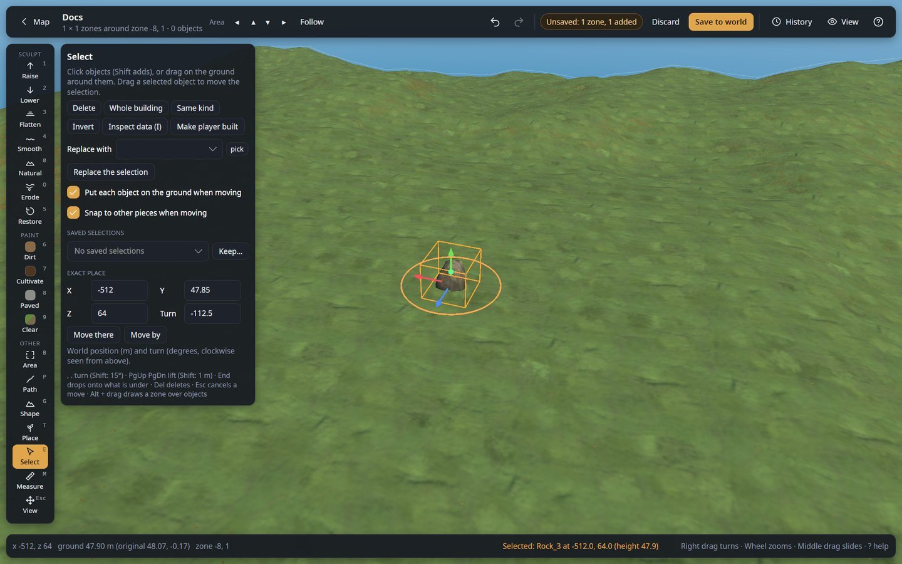
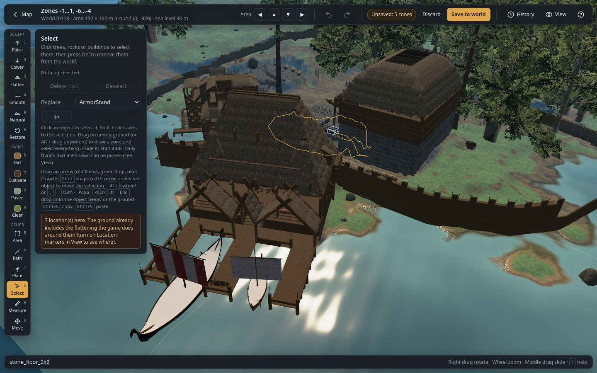
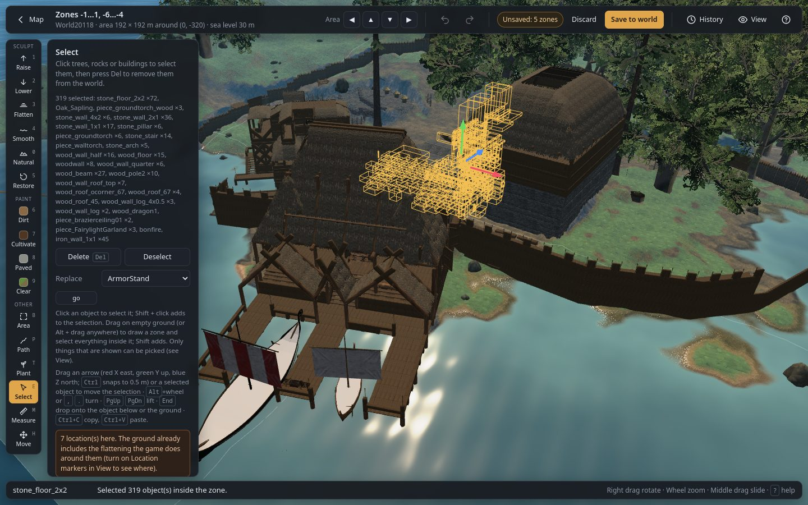

# Select (`E`)

Pick objects (trees, rocks, building pieces, anything shown), then move, turn, lift, drop, copy,
replace or delete them. Only objects that are shown can be picked; switch kinds on in the
[View panel](editor-basics.md#view-panel) first.

## Selecting

| Action | What it does |
|---|---|
| **Click** an object | Selects it (and only it). The yellow box marks selected objects; a blue box shows what is under the cursor. |
| **Shift + click** | Adds an object to the selection, or takes it out. |
| **Drag on empty ground** | Draws a zone; everything shown inside it is selected when you let go. |
| **Alt + drag** | Draws a zone even when you start over an object (useful in forests, where trees cover the ground). |
| **Shift + drag** | Adds what is inside the zone to the selection. |
| **Click on empty ground** / `Esc` | Clears the selection. |
| **Double-click a building piece** | Selects the whole building: every piece connected to it through pieces that touch (walls, floors, roofs, beams...). Pieces standing apart are not taken. |
| **Whole building** | Adds every piece connected to the selected pieces. |
| **Same kind** | Selects every shown object in the area of the kinds selected now (select one beech, then all the beeches). |
| **Invert** | Selects every shown object in the area that is not selected now. |
| **Saved** + **keep** | Keeps the selection under a name, for this world, in this browser. Pick it in the list, then **Select it** (or **Add it** to the current selection) to get it back, also after the world was saved; **Forget** removes it. Objects are found again by kind and position, so moved or deleted ones are counted as missing. |

The panel lists what is selected, by kind.

## Moving and turning

| Action | What it does |
|---|---|
| **Drag a selected object** | Moves the whole selection freely. Objects keep their height above the ground. |
| **Drag an arrow** | Moves the selection along one axis only: **red X** (east–west), **green Y** (up–down), **blue Z** (north–south). Hold **Ctrl** to move in 0.5 m steps. X and Z keep the height above the ground; Y raises or sinks. |
| `,` `.` or **Alt + wheel** | Turns the selection around its centre by 1° (Shift: 15°). |
| `PgUp` / `PgDn` | Lifts or lowers by 0.25 m (Shift: 1 m). |
| `End` | **Drops** each object onto what is below it: the top of another object (a floor, a table, a rock), or the ground when there is nothing. Selected objects do not count as surfaces. |
| `Esc` | Cancels a move that is still in progress. |

Moves are combined: everything you do within a moment becomes one undo step. A moved object keeps
all of its data (a moved chest keeps its contents).

## Other actions

| Control | What it does |
|---|---|
| **Delete** (`Del`) | Removes the selected objects. `Ctrl+Z` brings them back. |
| **Deselect** | Clears the selection. |
| **Replace** + **go** | Replaces every selected object by the chosen kind, at the same place and facing. |
| `Ctrl+C` | Copies the selection; `Ctrl+V` pastes it with the [paste tool](area.md#copy-and-paste). Copies are new, independent objects (a copied chest is empty). Pasted objects keep their height above the ground where they land. |

## Inspecting and changing an object's data

Like MCEdit's NBT editor: with one object selected, **Inspect data** (`I`) opens a panel with
everything the object holds in the save.

| Part | What it shows |
|---|---|
| **Contents** | For chests (and anything with an `items` value): every item with its stack, quality, durability (%) and slot (X, Y). The container's size comes from the game (a wood chest has 5 × 2 slots); carts and ships keep their container on a part, so their size is unknown. **Add item** puts a new item in the first free slot (type its name: `Wood`, `SwordIron`... the list suggests every item of the game); **✕** takes one out; **Tidy slots** moves every item to the first free slots, row by row. Items outside the slots would be hidden in game, so the editor asks before applying that. |
| **Data** | Every value, by the name the game uses (with a readable label for the common ones: Text (sign), Tag (portal), Builder, Health, Planted at...). Numbers and texts can be changed in place; **✕** removes a value (the game then uses its default). Whole numbers that are the name of a prefab (an item on an item stand, for example) show that name. Other binary data is listed but not changed here. |
| **Add** | Adds a value the object does not have yet: choose its kind, type its name as the game calls it (`text` for a sign, `tag` for a portal...) and the value. |
| **Apply changes** | Replaces the object by a copy with the new data, at the same place: one step in History, so `Ctrl+Z` puts the old one back. Save or Apply live writes it. A changed object can still be moved, turned and changed again, and keeps its data. |
| **Revert** | Forgets the changes made in the panel. |

The names of the values come from the game's code (`WorldGen/zdo-keys.json`); a value whose name is
not known is shown by its number. Change values only when you know what they do: the game may reset
or ignore values it does not expect.
