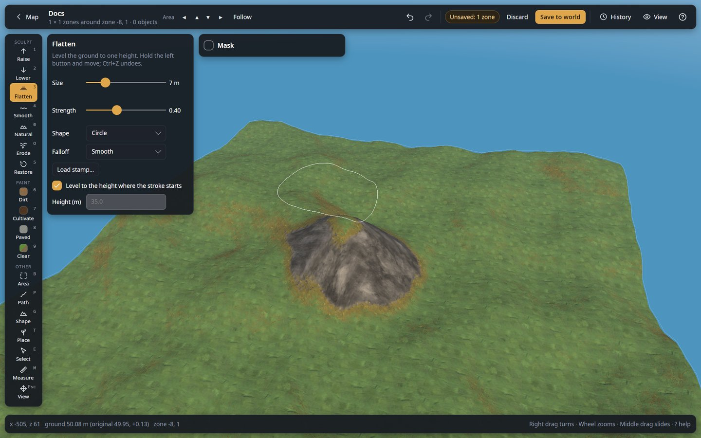
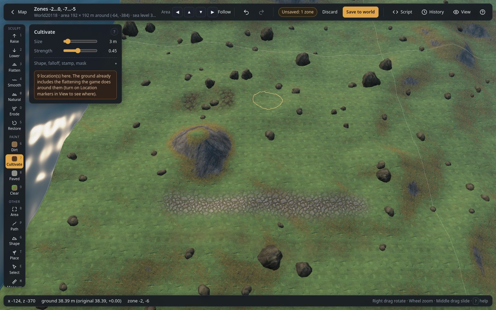

# Ground tools

The **Sculpt** and **Paint** tools work like the game's hoe and pickaxe, but with a brush you
hold and drag. The yellow ring on the ground is the brush. All of them work with the
[Mask](masks.md), and every stroke is one step in undo and History.

## Sculpt tools

| Tool | Key | What it does |
|---|---|---|
| **Raise** | `1` | Lifts the ground under the brush while you hold the button. |
| **Lower** | `2` | Digs the ground down. |
| **Flatten** | `3` | Levels the ground to one height: the height where the stroke starts, or a fixed height (below). |
| **Smooth** | `4` | Evens out bumps and sharp edges. |
| **Naturalize** | `0` | Turns flat, tool-made ground into natural-looking bumps (settings below). |
| **Restore** | `5` | Brings the ground back to how the world generated it, and removes paint. |

### Brush settings (all brushes)

| Control | What it does |
|---|---|
| **Size** | Brush radius in metres (`[` and `]` change it). The effect fades out smoothly towards the edge of the ring. |
| **Strength** | How fast the brush works while you hold the button. |
| **Shape** | **Circle**; **Square**; **Ring** (only a band around the middle: crater rims, moats, walls of earth); **Ragged** (a noisy, natural-looking edge); or a picture, see [Stamps](#stamps). The ring on the ground shows the shape. |
| **Falloff** | How the effect fades from the middle to the edge: **Smooth** (the default), **Linear**, **Dome** (round top, steep sides), **Flat top** (full strength almost to the edge: pads and terraces), **Peak** (strong in the middle only: spires and pits). |
| **Turn** | Turns a square brush or a picture (degrees); `,` and `.` change it by 1° (Shift: 15°). |
| **Mask** | Limits the brush to some ground, see [Mask](masks.md). |

### Flatten settings

| Control | What it does |
|---|---|
| **Level to the height where the stroke starts** | On (default): the ground under your first click sets the height; lower ground around it is raised and higher ground is cut, so you get a flat pad at that height. The Height box shows the height in use. |
| **Height** | Used when the option above is off: everything is levelled to this height (m). **Alt + click** the ground picks its height and switches to this fixed mode, handy to make several pads match. |

### Naturalize settings

| Control | What it does |
|---|---|
| **Bumps** | How tall the natural bumps are (m). |
| **Size** | How wide they are (m): small values give rough ground, large values gentle swells. |
| **New pattern** | A new random bump pattern for the next stroke (and for natural paths). |

The pattern is continuous across the world, so neighbouring strokes and areas match.

## Stamps

A stamp is a picture used as the brush shape, like WorldPainter's custom brushes: white parts work
fully, grey parts partly, black parts not at all. Choose one in **Shape**:

| Stamp | Shape |
|---|---|
| **Mountain** | A rough peak. |
| **Mesa (flat top)** | A flat top with steep, slightly ragged sides. |
| **Crater rim** | A ring wall, for craters (Lower inside it afterwards) and old earthworks. |
| **Dunes** | Parallel ridges inside a round patch. |
| **Rocky ground** | Lumpy, broken ground. |

| Control | What it does |
|---|---|
| **Load stamp…** | Uses any picture (PNG, JPEG...) as a stamp: a heightmap from another tool, a logo, a hand-drawn shape. It is shrunk to 128 × 128 points and kept in this browser, under its file name. |
| **Forget stamp** | Removes the loaded picture chosen as Shape (the built-in stamps stay). |
| **Stamp once** | With Raise or Lower: one click puts the whole stamp into the ground at once, the white parts **Height** metres up (or down), instead of painting while the button is held. One undo step; the ±8 m limit and the Mask apply. |

Stamps scale with **Size** and turn with **Turn** (`,` `.`). Without Stamp once they work like any
brush shape, with every sculpt and paint tool.

## Paint tools

| Tool | Key | What it does |
|---|---|---|
| **Dirt** | `6` | Bare dirt, like a trodden path. |
| **Cultivate** | `7` | Cultivated soil, as made by the cultivator. Crops only grow on it. |
| **Paved** | `8` | Paved stone ground. |
| **Clear** | `9` | Removes paint: back to the biome's own ground. |

Paint uses the same Size, Strength and Mask settings. Paint changes only how the ground looks and
what grows there; it does not change its height.

## Things to know

- **The 8 m limit.** The game stores ground changes as an offset from the generated ground and
  allows at most ±8 m. Points that reach it turn red and the status bar says so.
- **Locked edge.** The outer line of points of the loaded area cannot be changed, so it always
  joins the next area seamlessly. Move the area with the top-bar arrows to edit there.
- **Locations.** Villages, the trader, dungeon entrances and similar places flatten the ground
  around them while the game runs. The warning box in the tool panel counts them; the editor already
  shows the ground with that flattening.
- **Status bar.** It shows the ground height under the cursor, its original height, and the change.
