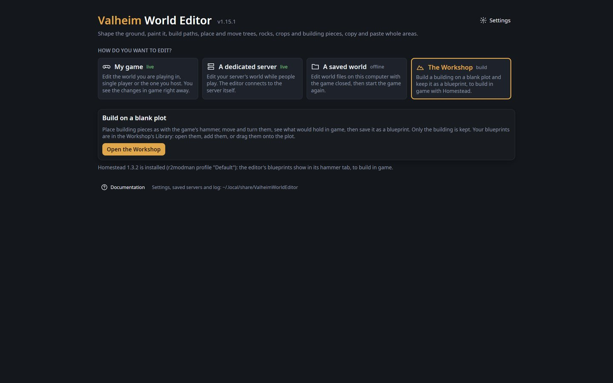

# The Workshop and the blueprint library

The editor keeps buildings as **blueprints** of [Homestead](https://thunderstore.io/c/valheim/p/sighsorry/Homestead/),
the in-game building mod. A blueprint saved here shows in Homestead's hammer tab, ready to build in
game with its materials chest. A blueprint saved in game with Homestead can be pasted or changed here.
Sharing a building means sharing its `.blueprint` file (and the `.png` picture beside it).

## Is Homestead installed?

The start page (under **My game**) and the Blueprints panel look for `Homestead.dll` in your game's
`BepInEx/plugins` folder and in mod manager profiles (r2modman, Thunderstore Mod Manager, Gale),
and show the version found. When Homestead is not there, the editor warns you and offers
**Get Homestead**. Blueprints are still saved where Homestead looks for them, so they show in game
once you install it.

Homestead checks versions with the server: a server that runs Homestead disconnects players who do
not have it (console players cannot). Players only need it on their own game to build blueprints.

Blueprints live in Homestead's folder of Valheim's save folder:
`~/.config/unity3d/IronGate/Valheim/Homestead/Blueprints` on Linux,
`%USERPROFILE%\AppData\LocalLow\IronGate\Valheim\Homestead\Blueprints` on Windows.

## The Workshop

The Workshop is a blank, flat meadow plot that is not part of any world. Open it from the start
page (**The Workshop**: **Open the Workshop**), or from a world's Blueprints panel (**New in
Workshop**, **Edit**).

### The Library

The Build panel's **Library** tab lists your blueprints (Homestead's), with their picture (drawn
from their pieces when a blueprint has none), piece count and cost; **Search blueprints** looks
through names, descriptions and tags.

| Action | What it does |
|---|---|
| **Open** | The blueprint alone on the plot, to change it (asks first when what is there is not saved). Saving writes it back. |
| **Add** | Adds the blueprint to what is on the plot, in its middle (one undo step). |
| **Drag a blueprint onto the plot** | Adds it where you drop it. |
| **Drop files** | `.blueprint` (Homestead, PlanBuild) and `.vbuild` files dropped from your files onto the plot are imported into the library and added where they land. |
| **Import file…** | Imports a file into the library. |

A blueprint keeps its form exactly (every piece where it was, turned as it was); it is moved as one,
so its lowest buildable piece (by its real shape) is on the ground. Rocks and other things the hoe
places do not count: they are not the building, and the support check leaves them out. A Homestead
blueprint saved again keeps its height from its anchor.

In game the building stood on uneven ground. The support check takes that ground to be under the
lowest piece of each spot (the terrain reached each post), or, for Homestead blueprints that record
them, at their terrain contact points. A piece with nothing below it at its spot therefore counts as
on the ground.

The Workshop keeps to building: the tool rail has only **Build**, **Select** and **View** (the
ground tools, Area, Path, Mountain and the rest are for worlds), and there is no Mask, View panel or
zone borders.

**Build** (T) lists everything players build: the game's hammer pieces in its tabs (**Building**,
**Heavy building**, **Furniture**, **Crafting**, **Misc**, **More**: walls, roofs, rugs, banners,
torches and lights…), the cultivator's (**Plants**) and the serving tray's (**Feasts**), each with a
small picture, grouped by the crafting station they need (none first, then the workbench,
stonecutter, forge…) and by name within each. **Search pieces** finds them in every tab. Click a piece
to pick it (its cost shows under the list), then click to put it down.

Pieces go where the game's hammer would put them, worked out from the game's own data for every
piece (its colliders, snap points and placement rules): the cursor's ray meets the ground or a piece
(its real shape); the piece, turned as you set it, touches that point; then, if one of its snap
points is within half a metre of a snap point of a piece already there, they meet. Point at a wall's
top to put the next one on it, near its end to put one beside it. Rugs and other pieces the game
places by their middle go right at the point.

| Option | What it does |
|---|---|
| **Snap to pieces** | Snapping, as in the game. Off: the piece stays where it touches (the game's Alt). |
| **Grid** | Off (as in the game), or the ground's point rounded to 0.5, 1 or 2 m from the plot's middle. |
| **Turn by** | How far **,** and **.** (or Alt + wheel) turn the piece: 22.5° as in the game, or 1°, 15°, 45°, 90°. Shift turns by 1°. |
| **Lift** | **Ctrl + wheel** lifts the piece (or lowers it) half a metre a notch from where it touches (Shift: 0.1 m), before it snaps. **Reset** puts it back. |

**Select** (E) moves, turns, lifts and deletes pieces. **Ctrl + click** adds a piece to the
selection; **Shift + click** takes the row from the last piece clicked (wall 1, then Shift + click
wall 3: walls 1, 2 and 3); dragging any selected piece moves them all. Ctrl+Z and Ctrl+Y undo and redo.

| Control | What it does |
|---|---|
| **Save blueprint** | Keeps the building as a Homestead blueprint. Only building pieces are kept: trees, rocks and items on the plot are left out. Asks for its name, a description and tags, and shows what it costs. Saving a blueprint you opened writes over it; another name makes a new one (replacing one of that name only after asking). |
| **Support check** | Tints each piece in the colours the game's build mode gives its structural support: **light blue** on the ground, then **green** through **yellow** to **red** as support runs out (red: it would fall). The piece's own look still shows through. |
| **Cut** | Sees the building from a height: nothing above it is shown (in metres above the plot, a metre at a time), and the cursor goes through what is hidden, so you can build inside. Left: off. |
| **Start** | Back to the start page (asks first when the building is not saved). |

The bar at the top counts the pieces, says how many would fall, and whether the building is saved.
Under the title: what it costs to build in game (point at it for the whole list).

### The support check

The check works out support as the game does (its `WearNTear` rules): every material (wood, core
wood, stone, iron, marble…) has a maximum support and loses some with each metre up and each metre
out. A piece on the ground has full support; a piece resting on others gets what they give, less its
material's loss. Pieces below their material's minimum break, then what they held is worked out
again. Saving a building with pieces that would fall asks first.

It does not count rocks or trees as support (the plot has none), and mesh colliders count by their box.

## The library (Blueprints panel)

In a world, **Blueprints** on the tool rail (or **Blueprints…** in the Area tool's panel) is a tool
like the others: its list of Homestead's blueprints takes the place of the tool's options, next to
the rail, and **✕** goes back to View. The Workshop's **Library** tab lists them too. Each shows:

- a **picture** of the building seen from above at an angle: the game's models with their textures
  when the [game's look](../README.md) has been copied, else each piece's shape in its material's colour.
  Homestead uses the same `.png` as the blueprint's icon in its hammer tab;
- its number of pieces, who made it and the world it came from;
- its **cost** in game: materials (most first) and the crafting stations it needs nearby;
- its **description** and **tags**.

**Search blueprints** finds blueprints with every word you type somewhere in their name, creator,
description or tags.

| Button | What it does |
|---|---|
| **Paste** | Puts it on the clipboard and starts pasting it into the open world. |
| **Edit** | Opens it in the Workshop. |
| **Details** | Changes its name, description and tags (the file and picture are renamed with it). |
| **.vbuild** | Writes it as a `.vbuild` file (BuildShare and older tools). |
| **Delete** | Removes its file and picture, after asking. Homestead loses it too. |
| **Import file…** | Reads a `.blueprint` (Homestead, PlanBuild) or `.vbuild` file and keeps it as a Homestead blueprint. Pieces the game does not know (from other mods) are left out. |

Copies kept as blueprints in older versions of the editor are listed under **Older editor
blueprints**; **To Homestead** turns one into a Homestead blueprint (its objects; Homestead
blueprints hold no ground).

### The file

A Homestead blueprint is a PlanBuild `.blueprint` file with Homestead's header lines. The editor
writes the description in its `#Description:` line and the tags in a `#Tags:` line (Homestead skips
lines it does not know). Each piece is `prefab;Building;x;y;z;qx;qy;qz;qw;"";1;1;1`, in metres from the
blueprint's anchor (the middle of the building at ground level).
